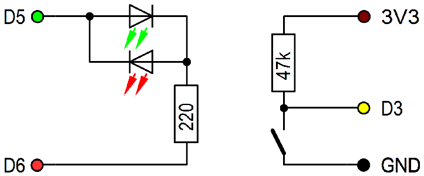

# D1 mini: MQTT Taster mit R&uuml;ckmeldung
Sketch: D1_oop43_mqtt_button1_led56.ino, Version 2018-12-23   
[English version](./README.md "English version")  

Das Dr&uuml;cken des Tasters an D3 sendet eine MQTT-Anfrage.   
Beim Programmstart leuchtet die Duo-LED rot und der D1 mini versucht sich mit dem MQTT-Broker zu verbinden. Gelingt dies, leuchtet die LED gr&uuml;n.   
Wird der Taster D3 gedr&uuml;ckt,    
* ver&ouml;ffentlicht der D1 mini das Topic `relay1/set/lamp` mit der Payload `toggle`   
* ver&ouml;ffentlicht der D1 mini die Taster-Information unter dem Topic  `button1/ret/function`   
* wird die blaue LED eingeschaltet   

Danach wartet der D1 mini auf das Topic `relay1/ret/lamp` mit der Payload 0 oder 1. Das Ergebnis wird mit Hilfe der blauen LED angezeigt:   
* Kommt keine Antwort, leuchtet die blaue LED kontinuierlich.   
* Ist die Antwort 0, blinkt die blaue LED mit kurzen Impulsen (1:9).   
* Ist die Antwort 1, blinkt die blaue LED mit langen Impulsen (9:1) f&uuml;r 20 Sekunden.   

__* Wichtig*__: Das Beispiel ben&ouml;tigt einen MQTT-Broker!!

## Hardware 
1. WeMos D1 mini
2. Protoboard mit Taster zwischen D3 und GND, sowie einer 2-Pin-Duo_LED zwischen D5 und D6 (und einem 100 Ohm Widerstand)

   
_Bild 1: D1mini mit Taster und Duo-LED_ 

   
_Bild 2: Schaltung D1mini mit Taster und Duo-LED_ 

##Software
Die Klasse MqttClientKH erweitert die Klasse PubSubClient f&uuml;r eine einfache Verwendung von MQTT. Es k&ouml;nnen alle Befehle der Klasse PubSubClient verwendet werden.
Wenn die Bibliothek PubSubClient in der Arduino-IDE installiert ist, k&ouml;nnen die Dateien `PubSubClient.*` im Verzeichnis `/src/mqtt` gel&ouml;scht werden.

### Erstellen einer MQTT Anwendung
1. Setup eines Brokers  
ZB Installation von mosquitto auf einem Raspberry Pi und starten des Programms     
`sudo apt-get install mosquitto`   
`sudo apt-get install mosquitto-clients`   
`sudo /etc/init.d/mosquitto start`   

2. Erstellen eines Klienten auf den D1 mini
* Klasse MqttClientKH einbinden   
  `#include "src/mqtt/D1_class_MqttClientKH.h"`  
* Ein MqttClientKH Objekt erzeugen  
  `MqttClientKH client("..ssid..", "..password..","mqtt server name");`  
__*Nicht vergessen: Daten an das eigene Netzwerk anpassen!*__
* Eine callback-Funktion definieren, um die angemeldeten Topics zu verarbeiten. Diese Funktion wird f&uuml;r alle angemeldeten Topics aufgerufen.   
  `void callback(char* topic, byte* payload, unsigned int length)`  
* In der Funktion setup() wird das MQTT setup ausgef&uuml;hrt:  
  `client.addSubscribe("topic");` Anmelden eines Topics (= Input). Wird in callback() bearbeitet.   
  `client.addPublish("topic", "startvalue");` Ver&ouml;ffentlichen einer Nachricht mit dem gegebenen Topic.  
  `client.setCallback(callback);` Setzen des Namens der callback-Funktion.   
  `client.reconnect();` Verbinden mit dem WLAN und MQTT-Server.   
  
* In der Funktion loop()  
  Aufruf von `client.isConnected()`, um die zyklische Abfrage des WLANs und von MQTT auszuf&uuml;hren (inklusive automatischer Wiederverbindung, falls die WLAN-Verbindung unterbrochen wurde).   
