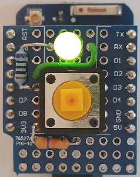
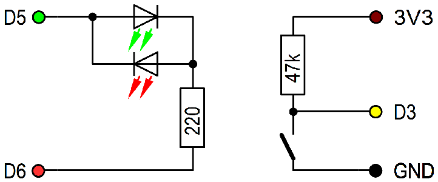

# D1 mini: MQTT button with feed back
Sketch: D1_oop43_mqtt_button1_led56.ino, Version 2018-12-23   
[Deutsche Version](./LIESMICH.md "Deutsche Version")   

Press button D3 to send a mqtt-request.   
On start LED lights red and D1 mini tries to connect to a mqtt-broker. On success led shines green.   
When button D3 is pressed, D1 mini   
* publishes topic `relay1/set/lamp` with payload `toggle`   
* publishes button info under topic `button1/ret/function`   
* turns blue led on   

Then D1 mini waits for topic `relay1/ret/lamp`, payload 0 or 1. The result is displayed using the blue led:   
* If there is no answer, the blue led shines continuous.   
* If the answer is 0, blue led blinks short pulses (1:9).   
* If the answer is 1, blue led blinks long pulses (9:1) for 20 seconds.   

__*Important*__: Example needs a broker!

## Hardware 
1. WeMos D1 mini
2. Protoboard with button connected between D3 and GND, 2pin duo led between D5 and D6 (with 100 Ohm resistor)

   
_Figure 1: D1 mini with button and duo led_ 

   
_Figure 2: Circuit D1mini with button and duo led_ 

##Software
The class MqttClientKH extends the class PubSubClient for an easy use of mqtt. You can use all commands from class PubSubClient as well.
When library PubSubClient is installed in arduino ide, delete files `PubSubClient.*` in directory `/src/mqtt`.

### How to make a D1mini mqtt application
1. Setup a broker  
E.g. install mosquitto on Raspberry Pi and start it  
`sudo apt-get install mosquitto`  
`sudo apt-get install mosquitto-clients`  
`sudo /etc/init.d/mosquitto start`  

2. Make a D1 client
* Include the class MqttClientKH  
  `#include "src/mqtt/D1_class_MqttClientKH.h"`  
* Define a MqttClientKH object  
  `MqttClientKH client("..ssid..", "..password..","mqtt server name");`  
__*Don't forget to change WiFi data to your network values!*__
* Define a callback function to process subscribed messages (is called by every subscribed topic)  
  `void callback(char* topic, byte* payload, unsigned int length)`  
* in function setup() do mqtt setup:  
  `client.addSubscribe("topic");` subscribe topic (=input). Handle it in  callback()!  
  `client.addPublish("topic", "startvalue");` publish massage by given topic  
  `client.setCallback(callback);` set (name of) callback function  
  `client.reconnect();` connect to WLAN and mqtt server  
* in function loop()  
  call `client.isConnected()` to process cyclic check for WLAN and mqtt (automatic reconnect, if connection is lost)  
