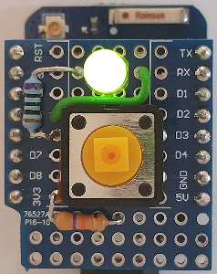
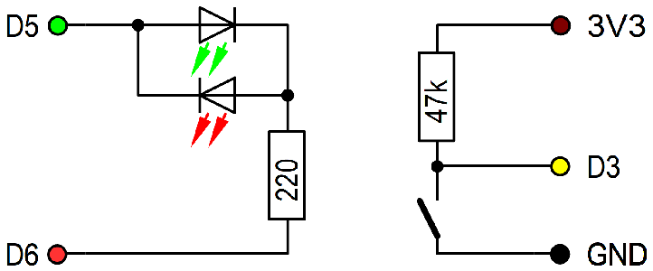

# D1 mini: MQTT Taster mit R&uuml;ckmeldung
Sketch: D1_oop43_smqtt_button3_led56.ino, Version 2021-01-09   
[English version](./README.md "English version")  

Das Dr&uuml;cken des Tasters an D3 sendet eine MQTT-Anfrage.   
Beim Programmstart leuchtet die Duo-LED rot und der D1 mini versucht sich mit dem MQTT-Broker zu verbinden. Gelingt dies, leuchtet die LED gr&uuml;n.   
Wird der Taster D3 gedr&uuml;ckt,    
* ver&ouml;ffentlicht der D1 mini das Topic `relay/1/set/relay` mit der Payload `toggle`,   
* leuchtet die blaue LED kontinuierlich.   

Danach wartet der D1 mini auf das Topic `relay1/ret/lamp` mit der Payload 0 oder 1. Das Ergebnis wird mit Hilfe der blauen LED angezeigt:   
* Kommt keine Antwort, leuchtet die blaue LED weiterhin kontinuierlich.   
* Ist die Antwort 1, blinkt die blaue LED mit langen Impulsen (9:1).   
* Ist die Antwort 0, blinkt die blaue LED mit kurzen Impulsen (1:9).   
* Bei allen anderen Antworten (Payloads) blinkt die blaue LED schnell.
* Nach 10 Sekunden wird die blaue LED abgeschaltet.   

__*Wichtig*__   
Das Beispiel ben&ouml;tigt einen MQTT-Broker und ein MQTT-Relais, das eine Anwort zurückschickt, zB D1 mini mit Programm `D1_oop77_smqtt_stm_relay1`.   

## Hardware 
1. WeMos D1 mini
2. Protoboard mit Taster zwischen D3 und GND, sowie einer 2-Pin-Duo_LED zwischen D5 und D6 (und einem 100&#8486; oder 220&#8486; Widerstand). Eventuell 47k&#8486;-Widerstand von D3 nach 3V3.   

   
_Bild 1: D1mini mit Taster und Duo-LED_ 

   
_Bild 2: Schaltung D1mini mit Taster und Duo-LED_ 

## Software
Die Klasse SimpleMqtt erweitert die Klasse PubSubClient zur einfachen Verwendung von MQTT. Es k&ouml;nnen alle Befehle der Klasse PubSubClient verwendet werden.   
Wenn die Bibliothek PubSubClient in der Arduino-IDE installiert ist, k&ouml;nnen die Dateien `PubSubClient.*` im Verzeichnis `/src/simplemqtt` gel&ouml;scht werden.

### Erstellen einer MQTT Anwendung
#### Setup eines Brokers  
ZB Installation von mosquitto auf einem Raspberry Pi und starten des Programms     
`sudo apt-get install mosquitto`   
`sudo apt-get install mosquitto-clients`   
`sudo /etc/init.d/mosquitto start`   

#### Erstellen eines Klienten auf dem D1 mini
1. Klasse SimpleMqtt einbinden   
  `#include "src/simplemqtt/D1_class_SimpleMqtt.h"`   

2. Ein SimpleMqtt Objekt erzeugen   
  `SimpleMqtt client("..ssid..", "..password..","mqtt server name");`  
__*Nicht vergessen: Daten an das eigene Netzwerk anpassen!*__   

3. Eine callback-Funktion definieren, um die angemeldeten Topics zu verarbeiten   
Diese Funktion wird f&uuml;r alle angemeldeten Topics aufgerufen.   
```
//_______MQTT: inspect all subscribed incoming messages_________
void callback(char* topic, byte* payload, unsigned int length)
{
 client.callback_(topic, payload, length);  // must be called!
}
```   

4. Funktionen f&uuml;r die get-, set- und sub-Funktionalität definieren
```
// sPayload: payload to message from TOPIC_GET
// auto answer: for help (+), version, ip (can be overwritten)
// return: ret answer payload for get request
String simpleGet(String sPayload)
{
 //-------------------------------------------------------------
 if(sPayload=="version") return String(VERSION43);
 //-------------------------------------------------------------
 //...ToDo...
 //-------------------------------------------------------------
 return String("");                    // wrong Get command
}

//_______execute set requests___________________________________
// sTopic from TOPIC_SET, sPayload: payload to topic
// return: ret answer payload for set command
String simpleSet(String sTopic, String sPayload)
{
 //-------------------------------------------------------------
 return String("");                    // wrong set command
}

//_______execute sub requests___________________________________
// sTopic from TOPIC_SUB, sPayload: payload to topic
// return: no automatic answer
void simpleSub(String sTopic, String sPayload)
{
}
```   

5. In der Funktion setup() die Verwendung von MQTT vorbereiten   

```
 //------setup mqtt---------------------------------------------
 client.setLanguage('e');              // e=english, d=german
 client.setCallback(callback);         // call back routine
 client.setTopicBaseDefault(TOPIC_BASE);
 client.setTopics(TOPIC_GET,TOPIC_SET,TOPIC_SUB,TOPIC_PUB);
 client.begin();                       // read eeprom...
```
   Eventuell auch gleich mit dem MQTT-Broker verbinden:  ` while(!client.connectWiFiMQTT());`
  
6. In der Funktion loop()  
Aufruf von `client.doLoop()`, um die zyklische Abfrage des WLANs und von MQTT auszuf&uuml;hren (inklusive automatischer Wiederverbindung, falls die WLAN-Verbindung unterbrochen wurde).   
```
 //======(3) do mqtt messages (send, receive)===================
 client.doLoop();                      // mqtt loop
```