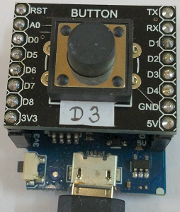

# Di mini: Taster schickt MQTT Kommando und zeigt Ergebnis mit blauer LED an
Version 2018-11-01, Datei: `D1_oop46_mqtt_button1_blueledint.ino`   
[English version](./README.md "English version")   

Das Dr&uuml;cken des Tasters D3 sendet ein MQTT Kommando &uuml;ber einen Broker  zu einem D1 mini mit Relais-Shield.  
Bei ersten Start des Systems leuchtet die blaue LED und der D1 mini versucht sich mit dem Netzwerk und MQTT-Broker zu verbinden. Gelingt dies, wird die blaue LED abgeschaltet, ansonsten blinkt sie schnell (ein:aus = 0.1s:0.1s).   
Wird der Taster D3 gedr&uuml;ckt, so   
* ver&ouml;ffentlicht der D1 mini das Topic `relay1/set/lamp` mit Payload `toggle`   
* ver&ouml;ffentlicht der D1 mini das Topic `button1/ret/function`   
* blinkt die blaue LED langsam (ein:aus = 0.5s:0.5s)   

Jetzt wartet der D1 mini auf das Topic `relay1/ret/lamp` mit der Payload 0 or 1.   
* Kommt keine Antwort, blinkt die blaue LED weiterhin langsam (ein:aus = 0.5s:0.5s).   
* Ist die Antwort 0, blinkt die blaue Led in kurzen Impulsen (ein:aus = 0.1s:0.9s).   
* Ist die Antwort 1, blinkt die blaue Led in langen Impulsen (ein:aus = 0.9s:0.1s).   

Nach 15 Sekunden wird die blaue LED abgeschaltet (um Energie zu sparen ;).   

__Wichtig 1__: Dieser Sketch ben&ouml;tigt einen Broker, zB ein Raspberry Pi als Access-Point f&uuml;r das WLAN `Raspi10` mit dem Passwort `12345678`, der statischen IP-Adresse `10.1.1.1` und installiertem Mosquitto Broker. Siehe [https://github.com/khartinger/Raspberry-as-mqtt-broker](https://github.com/khartinger/Raspberry-as-mqtt-broker "Raspberry pi as broker")   
__*Anpassung der WiFi Daten an das eigene Netzwerk*__ in Zeile   
`MqttClientKH client("..ssid..", "..password..","mqtt server name");`    

__Wichtig 2__: Dieser Sketch ben&ouml;tigt einen Empf&auml;nger zum Akzeptieren der Nachricht und zum R&uuml;cksenden der Antwort. Empf&auml;nger kann zB ein D1 mini mit Relais-Shield sein, siehe [https://github.com/khartinger/D1mini_oop/tree/master/D1_oop42_mqtt_relais1](https://github.com/khartinger/D1mini_oop/tree/master/D1_oop42_mqtt_relais1 "D1 mini: Schalte ein Relais mit MQTT")

## MQTT Nachrichten   
Um den Taster auch ohne Relais-Shield zu testen, ist folgendes zu tun:
* Verbinden mit dem WLAN (siehe oben)   
* &Ouml;ffnen eines Kommando-Fensters   
(MS Windows cmd oder eine putty-Verbindung zum Raspberry Pi mit dem User `pi`, Passwort `raspberry` oder `..ras..` oder einem anderen)   
* Anzeigen aller relay1-Nachrichten durch Eingabe von `mosquitto_sub -h 10.1.1.1 -t relay1/# -v`    
* &Ouml;ffnen eines zweiten Kommando-Fensters   
* Dr&uuml;cken des Tasters D3 (-> die blaue LED blinkt langsam)
* Im Fenster 2: Senden des unten stehenden Kommandos   
`mosquitto_pub -h 10.1.1.1 -t relay1/ret/lamp -m 0`   
* Die blaue Led blinkt mit kurzen Impulsen (entspricht dem Empfangen von 0, dh. die Lampe ist aus)
* Im ersten Fenster sollte folgende Anzeige erscheinen:
```
pi@raspberrypi:~ $ mosquitto_sub -h 10.1.1.1 -t relay1/# -v
relay1/set/lamp toggle
relay1/ret/lamp 0
```

### _get_ Anfragen   
* Topic `button1/get` mit payload `help` listet alle MQTT-Befehle auf, die das System versteht.   
* Topic `button1/get` mit payload `version` ergibt das Software-Datum und den Dateinamen.   
* Topic `button1/get` mit payload `function` ergibt eine kurze Beschreibung, was das System macht.   
* Topic `button1/get` mit payload `ip` ergibt die IP-Adresse des D1 mini.   
* Topic `button1/get` mit payload `all` bewirkt ein Aussenden aller m&ouml;glichen GET-Nachrichten.    
   

## Hardware
(1) WeMos D1 mini   
(2) 1-Button-Shield (D3)   
   
_D1mini mit 1-Button-Shield_


## Software
Dieser Sketch verwendet die Klassen        
* `D1_class_MqttClientKH` and `PubSubClient`    
* `D1_class_BlueLed`   
* `D1_class_Din`   
* `D1_class_Statemachine`   

(Siehe Verzeichnis `src`)   

