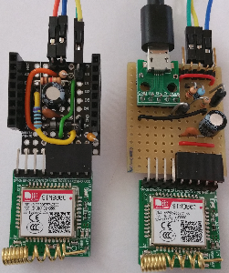

# D1 mini:  SMS auf Tastendruck, Anzeige auf OLED
Version 2018-12-30, Datei: `D1_oop55_sms_send_D3_oled.ino`   
[English version](./README.md "English version")   

Das Dr&uuml;cken des Tasters D3 bewirkt das Senden einer SMS an die Telefonnummer `TEL_NUMBER1` mit Hilfe eines Moduls "SIM800C GSM GPRS module STM32".   
* SIM-Verbindung: Software Serial @ D5 (=TX), D6 (=RX) __*oder*__  Hardware Serial @ TX, RX   
* Statusanzeige: OLED shield 0.66" 64x48px (Screen6)

Die Einstellung, welche Schnittstelle verwendet wird, ist abh&auml;ngig von der verwendeten Klasse zum Senden der SMS:   
* Klasse __`GSMmodule0`___: Die Einstellung der Schnittstelle erfolgt in der Datei `D1_class_GSMmodule0.h` durch den Wert der Konstanten __GSMMOD_SWS__:   
`#define GSMMOD_SWS            true     //software serial`   
`//#define GSMMOD_SWS           false     //hardware serial`   
* Klasse __`GSMmodule`__: Die Einstellung der Schnittstelle erfolgt beim Erstellen des Objektes. Ohne Parameter wird die Software-serielle Schnittstelle gew&auml;hlt, mit Parameter `false` wird die Hardware-Schnittstelle gew&auml;hlt. ZB   
`GSMmodule mod1;                        // SIM module soft serial`   
`//GSMmodule mod1(false);               // false=Hardware serial`   

Weiters muss in der Datei `D1_oop55_sms_send_D3_oled.ino` die Telefonnummer eingetragen werden, an die die Test-SMS geschickt werden soll:   
`#define  TEL_NUMBER1 "0680xxxxxxx"  // CHANGE TO YOUR OWN #!!`   

__*WICHTIG:*__ W&auml;hrend des Programmierens darf kein GSM-Modul an TX/RX der Hardware-seriellen Schnittstelle angesteckt sein!

## Hardware
1. WeMos D1 mini   
2. Battery Shield for WEMOS D1 mini mit kleinem Akku HM04S (3,7V 350mAh 1,3Wh)   
3. Selbstbau SIM800C 9pol ProtoBoard Shield mit angestecktem SIM800C GSM GPRS module STM32   
4. 2-Button OLED Shield   

   
_Bild 1: D1mini mit Battery Shield, 9pol ProtoBoard Shield und 2-Button-OLED-Shield.   
Zu Testzwecken ist sowohl an der Hardware- als auch Software-Schnittstelle ein GSM-Modul angeschlossen._ 

## Software - Details
Nach dem Programmstart werden zuerst die Ein-/Ausg&auml;nge initialisiert und danach in einer Schleife gepr&uuml;ft, ob ein Modem angeschlossen ist (Methode `isModule()`).   
Anschlie&szlig;end werden durch Aufruf der Methode `begin()` folgende  Einstellungen vorgenommen: Echo abschalten, SMS im Textformat, Modem-Speicher (ME) f&uuml;r SMS verwenden, die SMS-Nummer der ersten Speicherstelle im Speicher ermitteln und abfragen, in welchem Netz sich die SIM registriert hat.   
Danach wartet das Programm in `loop()` auf einen Tastendruck an D3. Dazu wird der Eingang D3 zweimal im Abstand von 25ms abgefragt und das Ergebnis verglichen. Dadurch wird verhindert, dass kurze Flanken bzw. St&ouml;rungen ein irrt&uuml;mliches Senden einer SMS ausl&ouml;sen.   
Wird eine fallende Flanke erkannt, wird die blaue LED eingeschaltet, die SMS verschickt, der Modem-Status nach dem Senden am OLED angezeigt und die blaue LED wieder abgeschaltet.

## Besonderheiten des Hardware-Aufbaus  
* Die Stromversorgung erfolgt &uuml;ber das Battery Shield, da der Spannungsstabilisator auf dem D1 mini nicht gen&uuml;gend (Spitzen-)Strom f&uuml;r das SIM-Modul liefert.   
* Der Anschluss des SIM-Moduls erfolgt &uuml;ber ein Selbstbau SIM800C 9pol ProtoBoard Shield und eine Software-Serial-Schnittstelle (D5=TX, D6=RX)   
* Der Anschluss eines PCs (zur Information) erfolgt &uuml;ber die TX/RX-Pins und einen 3,3V-RS232-Adapter.   
W&auml;hrend der Programmierung/Testphase kann dies auch &uuml;ber den USB-Anschluss und die Arduino-Programmieroberfl&auml;che erfolgen.   

## Vorbereiten des SIM-Moduls
* Micro-SIM-Karte kaufen, registrieren und aufladen.   
F&uuml;r &Ouml;sterreich: Pre-Paid-SIM zB von Drei, HOT oder B.free.   
* Einlegen der Micro-SIM-Karte in das SIM-Modul, danach das Modul mit einem 3,3V-RS232-Adapter mit der seriellen Schnittstelle eines PCs verbinden.   
* Ob die SIM-Karte vom Modul erkannt wird, kann mit Hilfe eines Terminalprogramms (zB Realterm) zB durch Abfragen der SIM-Kartennummer festgestellt werden:   
```
AT+CCID
+CCID
894310xxxxxxxxxxxx
```
* Welche Provider-Netze zur Verf&uuml;gung stehen, kann durch folgenden Befehl festgestellt werden:   
```
AT+COPS=?
+COPS: (1,"one","one","23205"),(2,"T-Mobile A","TMO A","23203"),(1,"A1","A1","23201"),,(0-4),(0-2)
OK
```
* Die Kontrolle, ob man in einem Netz eingew&auml;hlt ist erfolgt durch den gleichen Befehl OHNE Gleichheitszeichen:   
```
AT+COPS=?
+COPS: 1,0,"T-Mobile A"
OK
```

## Ansteuerung des SIM-Moduls
Ist das SIM-Modul angesteckt, so gibt die rote LED Hinweise zum Modul-Zustand:   
* Blinkt sie in kurzen Abst&auml;nden, ist sie beim Booten oder beim Versuch, sich in das Provider-Netz einzuloggen.
* Blitzt sie kurz im Abstand von ca. 3 Sekunden auf, ist sie zum Senden und Empfangen von SMS bereit.   
Kommt es w&auml;hrend des SMS-Sendevorgangs zum schnellen Blinken der LED, dann bootet das SIM-Modul neu. Das deutet darauf hin, dass die Stromversorgung zu schwach ist.

Die Software-Ansteuerung des SIM-Moduls erfolgt grunds&auml;tzlich durch Senden von AT-Befehlen. Zum &Uuml;berpr&uuml;fen des SIM-Moduls und zum Senden der SMS werden daher folgende drei AT-Befehle &uuml;ber die (Software-) serielle Schnittstelle gesendet:   
| Befehl                   | Bedeutung             |   
|--------------------------|-----------------------|   
| `ATE0`                   | Test, ob ein Modem angeschlossen ist und Abschalten des Zur&uuml;cksendens der empfangenen Befehle (Echo). Die Antwort sollte "OK" sein. |   
| `ATE1`                   | Schalte das Echo ein. |    
| `AT+CMGF=1`              | Umstellen des SMS-Formats auf Text. |    
| `AT+CPMS="ME","ME","ME"` | Define memory location for SMS (ME=Modul). |    
| `AT+CNMI=2,1,2,1,0`      | Info, wenn eine SMS empfangen wird. |    
| `AT+CMGS="0680xxxxxxx"`  | Senden einer SMS. Nach Eingabe des Befehls erscheint als Eingabeaufforderung ein Gr&ouml;&szlig;erzeichen &gt;, worauf der SMS-Text eingegeben werden kann. <br>__Wichtig__: Der SMS-Text muss mit &lt;Strg&gt;Z = 0x1A = 26 abgeschlossen werden! |       
### Einige weitere hilfreiche AT Kommandos
| Befehl                   | Bedeutung             |   
|--------------------------|-----------------------|   
| `AT+CPIN?`  | Test, ob eine SIM-Karte da ist und die PIN-Abfrage  nicht aktiviert ist. Die Antwort sollte sein: `+CPIN: READY` |    
| `AT+CGREG?` | Abfrage des Registrationsstatus des Modems. Antwort sollte sein: `+CGREG: 0,2`, wenn die SIM-Karte im Heim-Netzwerk des Providers registriert ist. |    
| `AT+COPS?`  | Abfrage der Network Information. Antwort sollte sein: `+COPS: 0,0,"one"`, wenn die SIM-Karte im Heim-Netzwerk des Providers registriert ist (oder "A1", "T-Mobile A" etc.). |    
| `AT+CSQ`    | Anzeige der Signalqualit&auml;t. Die Antwort k&ouml;nnte zB `+CSQ: 6,0` sein. <br>Werte f&uuml;r die Signalst&auml;rke: 0 = 113dBm oder weniger (kein Signal), 2..9 minimal, 10..14 OK, 15..19 gut, 20..30 ausgezeichnet, 31 = 51dBm oder gr&ouml;&szlig;er (besser), 99 Wert nicht bestimmbar/unbekannt. |    
| `ATD08006642903;` | Nummer f&uuml;r einen Sprachanruf w&auml;hlen (ZB Abfrage des Guthabens einer A1 prepaid SIM - Antwort kommt als SMS). <br>Nicht vergessen: den Anruf mit `ATH` beenden! |    
| `ATH`       | Beenden eines Sprachanrufs. |    
| `ATS0=1`    | Setzen der Anzahl an "RING"s vor dem automatischen Abheben eines eintreffenden Sprachanrufs. Nicht vergessen: den Anruf mit `ATH` beenden! Abschalten des automatischen Abhebens mit `ATS0=0`. |    
| `ATA`       | Abheben eines hereinkommenden Sprachanrufs. Nicht vergessen: den Anruf mit `ATH` beenden! |    
| `AT+CLCC`   | Anzeige, ob ein Sprachanruf aktiv ist. ("List Current Calls") |    
| `AT+COPS=0` | Netzwerk-Registrierung erzwingen. |    
| `AT+COPS=1,0,"A1"` | Manuelle Netzwerk-Registrierung im Netzwerk "A1". |    
| `AT+CCID`   | SIM-Kartennummer, zB 8943102101xxxxxxxxxf. |    
| `AT+CNUM`   | Sollte die eigene Telefonnummer anzeigen (ist nicht realisiert). |    

##Selbstbau SIM800C 9pol ProtoBoard Shield
Das SIM-Modul "SIM800C GSM GPRS module STM32" hat einige elektrische Besonderheiten:   
* Versorgungsspannung 3,4V bis 4,4V (NICHT 3,3V und NICHT 5V).   
Di Stromversorgung mit einem 3,7 V Lithium Akku ist laut H&auml;ndlerbeschreibung m&ouml;glich.
* Kurzzeitig sehr hoher Stromverbrauch beim SMS-Senden (bis zu 2A).
* Serieller Port Input: low -0,3..0,7V, high 2,1...3,1V   
Auch wenn in der H&auml;ndler-Beschreibung "Kompatibel mit 5V und 3V3 Systemen" steht, stimmt das nicht. Betr&auml;gt die Spannung an RX/TX 3,3V, so kommt es immer wieder zu Boot-Vorg&auml;ngen, speziell beim Versuch, eine SMS zu schicken.   
Auf der seriellen Schnittstelle wird dann pl&ouml;tzlich "Call Ready" und "SMS ready" ausgegeben und die rote LED blinkt schnell.   

Aus diesem Grund ist es erforderlich, eine Spannungsanpassungsschaltung zu erstellen (Voltage Interface Board). Der Aufbau kann auf einem ProtoBoard oder einer Lochrasterplatine erfolgen.   

   
_Bild 2: Schaltung des SIM800C 9pol ProtoBoard Shield_   

Die Erzeugung der 3,5V-(3,3V)Spannung mit Hilfe der Zenerdiode und dem 4,7kOhm-Widerstand ist nur notwendig, wenn man diese f&uuml;r einen 3,3V/RS232-Adapter ben&ouml;tigt. Ansonsten kann sie entfallen.   
Statt des USB-Anschlusses kann auch der 5V-Pin des D1 mini verwendet werden, wenn die Stromversorgung &uuml;ber ein Battery Shield erfolgt.

 ")      
_Bild 3: Prototypen der Interface Boards (Bauteil- und L&ouml;tseite)_   
Anmerkung: Bei der Bauteilplatzierung gibt es Optimierungspotenzial ;)

"SIM800C 9pol ProtoBoard Shield" (links im Bild): Oben ist der Anschluss f&uuml;r die serielle Hardware-Schnittstelle herausgef&uuml;hrt (RX-TX-GND-3V3).   
Lochrasterplatine (rechts im Bild): Die Stromversorgung des SIM-Moduls erfolgt &uuml;ber einen eigenen USB-Anschluss. Der Mikrocontroller (zB Raspberry Pi) ist &uuml;ber RX-TX-GND verbunden.

