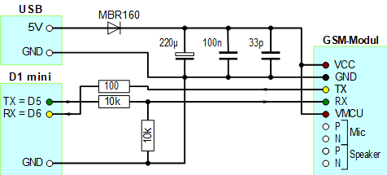

# D1 mini: Prepaid Balance Request by SMS, display on OLED. Uses soft serial.
Version 2019-01-05, File: `D1_oop59_sms_io_balance_oled_sws.ino`   
[Deutsche Version](./LIESMICH.md "Deutsche Version")   

Program asks for the prepaid balance by software serial and displays all program steps on OLED.   
Directory `gsmmodule2` contains software serial class in files `D1_class_softSerial2.*`.   

* SIM-Connection: Software Serial @ D5 (=TX), D6 (=RX) __*or*__ Hardware Serial @ TX, RX   
* Status info: OLED shield 0.66" 64x48px (Screen6)    

* Class __`GSMmodule2`__: Choose connection while creating the object. No parameter uses software serial, a parameter `false` chooses hardware serial. E.g.      
`GSMmodule2 mod1;                       // SIM module soft serial`   
`//GSMmodule2 mod1(false);              // false=Hardware serial`   

## Hardware
1. WeMos D1 mini   
2. Battery Shield for WEMOS D1 mini with a little rechargeable battery HM04S (3.7V 350mAh 1.3Wh)   
3. Selfmade SIM800C Adapter for "SIM800C GSM GPRS module STM32" (ProtoBoard Shield)   

   
_Figure 1: D1mini with Battery Shield, 9pol ProtoBoard Shield and 2-Button OLED Shield._ 

## Software - Details
On program start D1 mini tests in a loop, if a module is connected. (Method `isModule()`).   
After this D1 mini tries to do settings by method `begin()`: Turn echo off, set SMS text format, use modem memory (ME), calculate number of first SMS in memory and check, to which network the SIM connected.   
Then some info is shown on OLED: registered network, SIM-ID, type of used memory, number of the first sms location, number of stored SMS and maximum number of SMS to be stored.   
After sending the Request D1 mini waits for the answer SMS. Receiving the answer SMS, value, date and time is displayed on OLED.   

## Special features of the hardware structure  
* The power supply of the SIM module is done by a battery shield and a rechargeable battery, because the D1 mini is not able to deliver sufficient (peak) energy.   
* SIM module is connected by a selfmade SIM800C adapter and software serial (D5=TX, D6=RX)   
* Optional: PC is connected by hardware serial TX/RX-pins and a 3.3V-RS232-Adapter.   
While testing you also can use the Arduino-IDE and USB-connection.   

   
_Figure 3: Circuit of D1 mini SIM800 shield._ 

## Prepare the SIM module
* Buy a micro SIM card, register it and top up your credit.   
  For Austria: Use a Pre-Paid-SIM e.g. from Drei, HOT or B.free.   
* Insert micro SIM card into SIM module and connect to a PC via 3.3V-RS232-Adapter   
* The red LED of the SIM module indicates the state:   
--> Blinking at short intervals indicates, that the module is booting or trying to log in to a provider network.   
--> A flashing LED every 3 seconds indicates, that the module is ready to send or receive SMS.   
* If the LED begins to blink in short intervals while sending a SMS, this indicates, that the module boots again. Perhaps  the voltage supply is too weak.   

## Control the SIM module
The software control of the SIM module is done by AT commands.   
| Command | Meaning |   
|---------|---------|   
| `ATE0`  | Force no sending back commands (no echo). Answer should be "OK". |    
| `ATE1`  | Force sending back commands (echo). Answer should be "OK". |    
|`AT+CMGF=1` | Set text format. |    
|`AT+CPMS="ME","ME","ME"` | Define memory location for SMS (ME=Modul). |    
|`AT+CNMI=2,1,2,1,0` | Info, when a SMS is received. |    
| `AT+CMGS="0680xxxxxxx"` | Send a SMS. After sending the command a greater than sign &gt; appears and module waits for the SMS text.  __Important__: Finish SMS text with &lt;Strg&gt;Z = 0x1A |   
|`AT+CMGR=21` | Read SMS at location 21. Result might be: `AT+CMGR=21<cr>` `+CMGR: "REC UNREAD","+43680xxxxxxx","","18/12/15,17:06:50+04"<cr><lf>` `#led on#<cr><lf><cr><lf>OK<cr><lf>` |   

### Some more helpful AT commands
| Command | Meaning |   
|---------|---------|   
| `AT+CPIN?`  | Check, if SIM card is present and unlocked. Answer should be `+CPIN: READY` |    
| `AT+CGREG?` | Check the registration status of the device. Answer should be `+CGREG: 0,2` if SIM card is registred in the home network. |    
| `AT+COPS?`  | Get the network information. Answer should be `+COPS: 0,0,"one"` if the device is registered on the home network (or "A1", "T-Mobile A" etc.) |    
| `AT+CSQ`    | Get the signal quality. Answer may be `+CSQ: 6,0`.  Values for signal strength: 0 = 113dBm or less (no signal), 2..9 marginal, 10..14 OK, 15..19 good, 20..30 excellent, 31 = 51dBm or greater (better), 99 unknown. |    
| `ATD08006642903;` | Dial the number for a voice call (e.g. ask for a sms with credit content when using A1 prepaid SIM).  Don't forget to hang up with `ATH`! |    
| `ATH`       | Hangup a voice call. |    
| `ATS0=1`    | Set number of "RING"s before picking up an incomming call automatically. Don't forget to hang up with `ATH`! Disable auto-answering feature with `ATS0=0`. |    
| `ATA`       | Pick up an incoming voice call. Don't forget to hang up with `ATH`! |    
| `AT+CLCC`   | List Current Calls: Check, if a voice call is in progress. |    
| `AT+COPS=0` | Force network registration. |    
| `AT+COPS=1,0,"A1"` | Manual network registration to network "A1". |    
| `AT+CCID`   | Number of SIM card, e.g. 8943102101xxxxxxxxxf |    
| `AT+CNUM`   | Should show the phone number of the device (not implemented). |    

##Self made SIM800C 9pol ProtoBoard Shield
The SIM modul "SIM800C GSM GPRS module STM32" has some electrical specials:   
* Voltage supply 3.4V to 4.4V (NOT 3.3V and NOT 5V).   
Power supply from a 3.7 V lithium rechargeable battery should be possible according to the technical dossier of the manufacturer.
* Module needs a high current while sending a SMS (up to 2A).
* Serial port input: low -0.3..0.7V, high 2.1...3.1V   
Although manufacturer write "compatible to 3.3V and 5V systems" is this not correct. If the voltage on RX/TX pins is 3.3V, it sometimes comes to a boot process, especially if you send a SMS.   
You see the messages "Call Ready" and "SMS ready" at Serial and the red LED blinks in short intervals.   

It is a good idea, to use a voltage interface board, that can be build on a breadboard (hole matrix board).

   
_Figure 4: Circuit of the SIM800C 9pol ProtoBoard Shield_   

The 3.5V voltage generation with a zener diode is just necessary, if you use a RS-232 connector that needs this. Otherwise you can omit it.
Instead of the USB-Connector you can use the 5V pin of the D1 mini, if voltage supply is done by a battery shield (this is stronger/better than D1 mini voltage supply)

 ")      
_Figure 5: Prototypes of SIM800-interface boards (component- and solder side)_   
Note: part placement may be optimized ;)

"SIM800C 9pol ProtoBoard Shield" (left in figure 3): connector for hardware serial on the top (RX-TX-GND-3V3).   
Hole matrix board (right in figure 3): Voltage supply by a seperate USB connector. A micro controller (e.g. raspberry pi) may be connected using RX-TX-GND.

