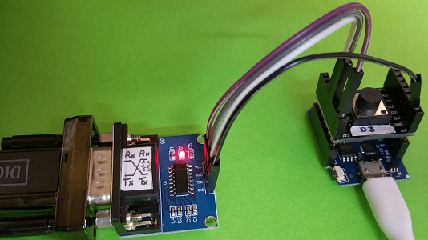

# D1 mini: Messung der Zeit zwischen zwei Impulsen
Version 2019-01-18, Datei: `D1_oop62_sws_idlemeterD3.ino`   
[English version](./README.md "English version")

Dieses Programm testet die Klasse `Idlemeter`, die die Zeit zwischen zwei Impulsen (genauer zwischen zwei fallenden Flanken) misst und sich die Beginnzeit und die maximale Zeitdauer zwischen zwei Impulsen innerhalb einer gewissen Periode merkt.   
Die Impulse werden durch einen Taster an D3 erzeugt und nach jedem Tastendruck werden folgende Informationen &uuml;ber die Software-serielle Schnittstelle &uuml;bertragen:   
* Aktuelle Zeit (= Anzahl Millisekunden nach dem Systemstart)
* Startzeit und Dauer der gerade beendeten "Ruhezeit" (= Zeit zwischen zwei fallenden Flanken)
* Startzeit und Dauer der l&auml;ngsten "Ruhezeit" innerhalb der letzten Periode (zB 30 Sekunden)

Setzt man `DEBUG62` auf `true`, werden die Werte zus&auml;tzlich auch &uuml;ber die Hardware-serielle Schnittstelle gesendet.

## Hardware
1. WeMos D1 mini   
2. 3V3/RS-232-Adapter, der zB an einem Laptop oder PC angeschlossen ist. Verbindung &uuml;ber   
TXD <---> D6 (=RX), RXD <---> D5 (=TX), GND
3. 1-Button-Shield D3 (zur Impulserzeugung)

   
_Bild 1: Messung der Ruhezeit zwischen zwei Impulsen (Flanken). Links: Adapter f&uuml;r Software Serial._ 

## Software - Testprogramm
* Die Abfrage des Tasters erfolgt mittels Interrupt (fallende Flanke). Der Zustand des Tasters wird dreimal hintereinander abgefragt, um sicher zu sein, dass kein St&ouml;rimpuls vorliegt.
* Zum Erfassen der Daten ruft die Interruptroutine die Methode `next()` der Klasse `Idlemeter` auf.
* In der Standardfunktion `loop()` wird abgefragt, ob die Daten eines neuen Impulses vorliegen. Wenn ja, werden die Daten ausgegeben.
* Zus&auml;tzlich wird in `loop()` jede Sekunde ein Punkt an die Schnittstelle(n) gesendet, damit man sieht, dass das Programm noch l&auml;uft.

###Beispiel-Ausgabe auf der seriellen Schnittstelle (9600Bd)
```
2019-01-18 D1_oop62_sws_idlemeterD3
Measure (idle) time between two pulses, show on software serial
Period: 30 sec
....
Now: 4s | Last @ 0s: 3s | MAX @ 0s: 3s
............
Now: 16s | Last @ 3s: 12s | MAX @ 3s: 12s
........
Now: 24s | Last @ 15s: 7s | MAX @ 3s: 12s
...
Now: 27s | Last @ 23s: 3s | MAX @ 3s: 12s
.....
Now: 32s | Last @ 26s: 4s | MAX @ 3s: 12s
.....
Now: 37s | Last @ 31s: 5s | MAX @ 15s: 7s
.........
Now: 46s | Last @ 37s: 8s | MAX @ 37s: 8s
```

## Software - Klasse Idlemeter

### Abk&uuml;rzungen, Definitionen
`#define  PERIOD_MS           30000     // 30 Sekunden`   

Die beiden Werte Startzeit und Dauer der "Ruhezeit" werden zu einer Struktur `idleData` zusammengefasst:
```
struct idleData{
 unsigned long msIdle=0;              // idle duration
 unsigned long msStart=0;             // start time
};
```

### Arbeitsweise 
Bei Eintreffen eines Impulses muss die Methode `next()` aufgerufen werden.   

Die Methode `next()`   
* misst die Zeitdauer des letzten Impulses ("Ruhedauer") und speichert sie gemeinsam mit der Startzeit in der Struktur `last_`.   
* kontrolliert, ob die gespeicherten Maximalwerte veraltet sind. Ist die aktuelle Zeit gr&ouml;&szlig;er als die Periodendauer wird gepr&uuml;ft, ob   
*** die Startzeit der bisher zweitl&auml;ngsten Ruhezeit (`max2_.msStart`) bereits zu weit in der Vergangenzeit liegt. Ist dies der Fall, werden die Werte der zweitl&auml;ngsten Ruhezeit (Startzeit und Ruhedauer) auf 0 gesetzt.   
*** die Startzeit der bisher l&auml;ngsten Ruhezeit (`max1_.msStart`) bereits zu weit in der Vergangenzeit liegt. Ist dies der Fall, wird die bisher zweitgr&ouml;&szlig;te Ruhezeit zum neuen Maximium.   
* kontrolliert, ob die Dauer ("Ruhezeit") des letzten Impulses gr&ouml;&szlig;er als das bisherige Maximum ist.   
*** Wenn ja, wird das bisherige Maximum1 (`max1_`) zum Maximum2 (`max2_`) und der letzte Wert (`last_`) zum neuen Maximum1 (`max1_`).   
*** Wenn nein, wird kontrolliert, ob die Dauer ("Ruhezeit") des letzten Impulses gr&ouml;&szlig;er als das bisherige Maximum2 ist. Wenn ja, wird der letzte Wert (`last_`) zum neuen Maximum2 (`max2_`)
* setzt die Eigenschaft `isNew_` auf `true` und merkt sich die neue Startzeit (`starttime_ms`).   


&nbsp;

###Methoden
| Klasse *Idlemeter*               | Bedeutung                                |
|----------------------------------|------------------------------------------|
| + __Idlemeter()__                | Default-Konstruktor. Ruft setup() mit der Periodendauer `PERIOD_MS` (30 Sekunden) auf. |   
| <nobr>+ __Idlemeter(unsigned long period_ms)__</nobr> | 2. Konstruktor. Ruft setup() mit der gegebenen Periodendauer auf. |   
| ~ setup(unsigned long period_ms) | Setzt die Eigenschaft Periodendauer. |   
| + void  reset()                  | Setzt alle Messwerte auf null (`last_`, `max1_`, `max2_`), `isNew_` auf `false` und bestimmt die Startzeit (`starttime_ms`). |    
| + __bool  isNew()__              | Liefert `true`, wenn ein neuer Messwert vorliegt und dieser noch nicht abgefragt wurde. |   
| + idleData getLast()             | Liefert den letzten Messwert. |   
| + __idleData getMax()__          | Liefert den aktuellen Maximalwert. |   
| + idleData getMax2()             | Liefert den zweitgr&ouml;&szlig;ten Maximalwert. |   
| + void  setPeriod(unsigned long period_ms) | Setzt die Periodendauer in Millisekunden, f&uuml;r die der jeweilige Maximalwert ermittelt wird. |   
| + unsigned long getPeriod()      | Liefert die Periodendauer in Millisekunden. |   
| + unsigned long getStarttime()   | Liefert die Startzeit der aktuell laufenden Messung. |   
| + __void next()__                | F&uuml;hrt die Messung bei einem auftretenden Impuls durch. (Details siehe oben) |   

###Eigenschaften
|  *Eigenschaft*       | Bedeutung                                           |
|----------------------|-----------------------------------------------------|
| ~ idleData last_     | Letzter, abgeschlossener Messwert (Zeit, L&auml;nge). |
| ~ idleData max1_     | Werte der maximalen "Ruhezeit" (Zeit, L&auml;nge) innerhalb der Periode. |
| ~ idleData max2_     | Werte der zweitgr&ouml;&szlig;ten "Ruhezeit" (Zeit, L&auml;nge) innerhalb der Periode. |
| ~ bool isNew_        | `true`, wenn ein neuer Messwert vorliegt. |
| <nobr>~ unsigned long starttime_ms_</nobr> | Startzeit der aktuell laufenden Messung in Millisekunden. |
| ~ unsigned long period_ms_ | Zeitdauer (Periode), f&uuml;r die die l&auml;ngste Ruhezeit ermittelt wird. |
