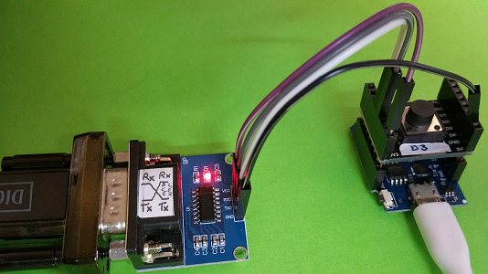

# D1 mini: Measure time between two Impulses
Version 2019-01-18, File: `D1_oop62_sws_idlemeterD3.ino`   
[Deutsche Version](./LIESMICH.md "Deutsche Version")   

This program tests the class `Idlemeter`, that measures the duration between two impulses (exactly: between two falling edges). The last start time and duration and the values of the longest duration within a specified period (time) are stored.   
Pressing a button D3 sends the following information by software serial:   
* actual time (= milliseconds since system start)
* start time and duration of just finished "delay time" (= time between to falling edges)
* start time and duration of the longest "delay time" within the last period (e.g. 30 seconds)

If `DEBUG62` is `true`, this values are also sent to hardware serial.

## Hardware
1. WeMos D1 mini   
2. 3V3/RS-232-Adapter, e.g. connected to a laptop or PC by   
TXD <---> D6 (=RX), RXD <---> D5 (=TX), GND
3. 1-Button-Shield D3 (to generate pulses)

   
_Figure 1: Measure "delay time" between two pulses (edges). On the left: Adapter for software serial._ 

## Software - Test program
* Pressing the button produces an interrupt (falling edge). The state of the button is checked three times to be sure, that there was no interference pulse.
* To get the data, the interrupt routine calls method `next()` of class `Idlemeter`.
+ Function `loop()` checks, if there is a new impulse result. If yes, data are sent to serial.
* Additionally `loop()` sends a point character to serial every second to show, that the program is (still) running.

###Example serial output (9600Bd):   
```
2019-01-18 D1_oop62_sws_idlemeterD3
Measure (idle) time between two pulses, show on software serial
Period: 30 sec
....
Now: 4s | Last @ 0s: 3s | MAX @ 0s: 3s
............
Now: 16s | Last @ 3s: 12s | MAX @ 3s: 12s
........
Now: 24s | Last @ 15s: 7s | MAX @ 3s: 12s
...
Now: 27s | Last @ 23s: 3s | MAX @ 3s: 12s
.....
Now: 32s | Last @ 26s: 4s | MAX @ 3s: 12s
.....
Now: 37s | Last @ 31s: 5s | MAX @ 15s: 7s
.........
Now: 46s | Last @ 37s: 8s | MAX @ 37s: 8s
```

## Software - Class Idlemeter

### Shortcuts, Definitions
`#define  PERIOD_MS           30000     // 30 seconds`   

Start time and "delay" duration are combined to a struct `idleData`:   
```
struct idleData{
 unsigned long msIdle=0;              // idle duration
 unsigned long msStart=0;             // start time
};
```

### Operation 
If a pulse is here, method `next()` must be called.   

The method `next()`   
* measures the "delay time" of last pulse and stores it with the start time in a struct `last_`.   
* checks, if stored values are too old. If the actual time is greater than the period time it checks, if   
*** the start time of the second longest "delay time" (`max2_.msStart`) is too old. In this case the values of the second maximum are set to 0.   
*** the start time of the longest "delay time" (`max1_.msStart`) is too old. In this case the second longest Maximum becomes the new maximum.
* checks, if the duration ("delay time") of the last impulse is greater than the maximum.   
*** If yes, the last maximum1 (`max1_`) becomes maximum2 (`max2_`) and the last value (`last_`) becomes new maximum1 (`max1_`).    
*** If no, `next()` checks, if the "delay time" of the last pulse is greater than the value of the second longest maximum (`max2_`). If yes, the last value (`last_`) becomes new maximum2 (`max2_`).   
* sets the property `isNew_` to `true` and saves the new start time  (`starttime_ms`).   


&nbsp;

###Methods
| class *Idlemeter*                | Meaning                                  |
|----------------------------------|------------------------------------------|
| + __Idlemeter()__                | Default-Constructor. Calls setup() with a period of `PERIOD_MS` (30 seconds). |   
| <nobr>+ __Idlemeter(unsigned long period_ms)__</nobr> | 2. Constructor. Calls setup() with given period. |   
| ~ setup(unsigned long period_ms) | Set property period. |   
| + void  reset()                  | Set all values to zero (`last_`, `max1_`, `max2_`), `isNew_` to `false` and save the start time (`starttime_ms`). |    
| + __bool  isNew()__              | Is `true`, if there is a new measured value and it has not been requested until now. |   
| + idleData getLast()             | Return the last measured value. |   
| + __idleData getMax()__          | Return the actual maximum. |   
| + idleData getMax2()             | Return the second longest maximum. |   
| + void  setPeriod(unsigned long period_ms) | Sets period time [in milliseconds] for measuring the maximum "delay time" within. |   
| + unsigned long getPeriod()      | Return the period duration in milliseconds. |   
| + unsigned long getStarttime()   | Return the start  time of actual measuring. |   
| + __void next()__                | Do measuring after a pulse. (Details see above) |   

###Properties
|  *Property*          | Meaning                                             |
|----------------------|-----------------------------------------------------|
| ~ idleData last_     | Last measured value (starttime, duration).          |
| ~ idleData max1_     | "Delay time" maximum (starttime, duration) within a period. |
| ~ idleData max2_     | Second largest value of "delay time" (starttime, duration) within a period. |
| ~ bool isNew_        | `true`, if a new value is here. |
| <nobr>~ unsigned long starttime_ms_</nobr> | Starttime of actual measurement in milliseconds. |
| ~ unsigned long period_ms_ | Duration ("period"), within the longest "delay time" is measured. |
