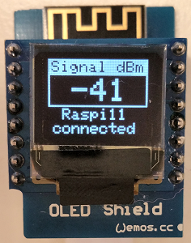

# D1 mini: Anzeige der WLAN-St&auml;rke auf OLED
Version 2019-01-19, Datei: `D1_oop63_Wifimeter_oled.ino`   
[English version](./README.md "English version")   

Dieses Programm zeigt die St&auml;rke des WLANS auf einem OLED-Shield 0.66" an.   
__Anmerkung__: Die Netzwerkdaten werden direkt in den Quellcode eingetragen.   

## Hardware
1. WeMos D1 mini   
2. OLED Shield  (SSD1306, 64x48 pixel, I2C-address 0x3D)

   
_Bild 1: Anzeige der WLAN-St&auml;rke._ 
