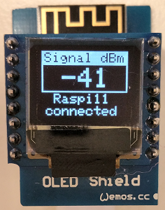

# D1 mini: Display WiFi strength on OLED
Version 2019-01-19, File: `D1_oop63_Wifimeter_oled.ino`   
[Deutsche Version](./LIESMICH.md "Deutsche Version")   

This program displays the WiFi strength on a D1 mini with OLED shield 0.66".   
__Note__: WiFi data are hard coded in sourcecode.   

## Hardware
1. WeMos D1 mini   
2. OLED Shield  (SSD1306, 64x48 pixel, I2C-address 0x3D)

   
_Figure 1: Display WiFi strength._ 
