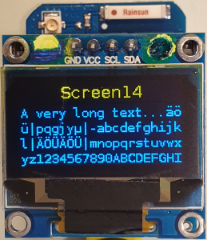

# D1 mini mit 0,96"-OLED: Pixeltest und langer Text
Version 2019-10-24, Datei: `D1_oop64_oled096_screen14_1.ino`   
[English version](./README.md "English version")   

Dieses Programm schaltet zuerst (zur Kontrolle) alle Pixel eines 0,96"-OLEDs ein und gibt danach einen langen Text mit Hilfe der Methode screen14 auf dem Bildschirm aus.  
Verwendung der Klasse __`Screen096`__ (verwendet __SSD1306Wire__, __OLEDDisplay__ und __Print__).

## Hardware
* WeMos D1 mini   
* OLED 0,96" mit SSD1306, 128x64 pixel, I2C (4 Pins, 0x3C), das auf einem "ProtoBoard Shield for WeMos D1 mini" (AliExpress) montiert ist   
(SCL=D1=DGPIO5, SDA=D2=GPIO4, OLED_RESET GPIO0)

   
_Bild 1: OLED 0.96": Alle Pixel ein_   

   
_Bild 2: OLED 0.96": 1 Pixel breiter Rand_   

   
_Bild 3: OLED 0.96": screen14: Titel und ein langer Text mit Zeilenumbr&uuml;chen_   

