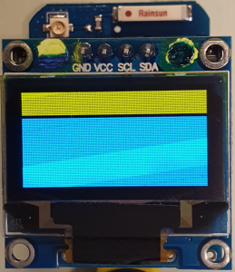
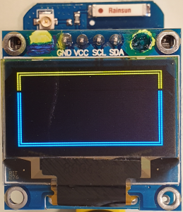
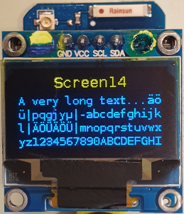

# D1 mini with 0.96"-OLED: Test OLED and show long text
Version 2019-10-24, File: `D1_oop64_oled096_screen14_1.ino`   
[Deutsche Version](./LIESMICH.md "Deutsche Version")   

This program turns on all pixel (for test) and shows afterwards a long text using method screen14.   
Uses class __`Screen096`__ (uses __SSD1306Wire__, __OLEDDisplay__ und __Print__).

## Hardware
* Wemos D1 mini
* OLED 0.96" with SSD1306, 128x64 pixel, I2C (4 pins, 0x3C)   
  mounted on a "ProtoBoard Shield for WeMos D1 mini" (AliExpress)   
  (SCL=D1=DGPIO5, SDA=D2=GPIO4, OLED_RESET GPIO0)

   
_Figure 1: OLED 0.96": all pixel on_   

   
_Figure 2: OLED 0.96": 1-pixel-border_   

   
_Figure 3: OLED 0.96": screen14: title and long text with line breaks_   

