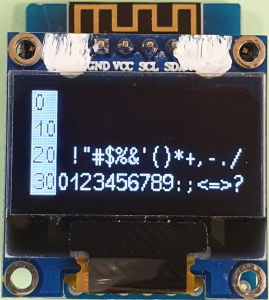
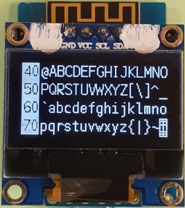
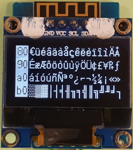
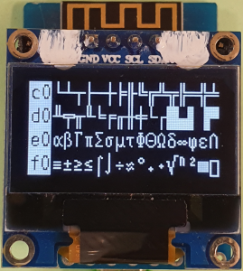

# D1 mini: Anzeige aller CP437 16 Pixel hohen Zeichen auf einem OLED 0.96"
Version 2020-01-07 D1_oop65_oled096_cp437_allchar16.ino   
[English version](./README.md "English version")   

Dieses Beispiel schreibt alle Zeichen (Wert 32 ... 255) des eingebauten Codepage-CP437-Zeichensatzes `fontKH_cp437_16x7` (16 Pixel Zeichenh&ouml;he) auf ein OLED 0,96" (128x64 pixel).   
Spezialit&auml;t des eingebauten Zeichensatzes: Zeichen 0x80 = 128 = &#x20AC; (= Euro, statt &#xc7;)   

       
_Bild 1: Zeichen 0 bis 63 (0x00..0x3F) und 64 bis 127 (0x40..0x7F)_   

       
_Bild 2: Zeichen 128 bis 191 (0x40..0xBF) und 192 bis 255 (0xC0..0xFF)_  

### Hardware
(1) WeMos D1 mini   
(2) Einf&auml;rbiges OLED 0.96" (128x64 pixel, I2C-addr 0x3C), montiert auf einem Protoboard (proto shield)    

### Software
Die Software verwendet die Dateien (Klassen) `D1_class_Screen096`, `OLEDDisplay`, `SSD1306Wire` und `OLEDDisplayFonts.h` (siehe Verzeichnis `src\screen096`)   

__Software Details__  
* Kopiere 16 (CP437-)Zeichen in ein Feld (array), wandle die Zeichen in ein Utf8-Array um und dieses Feld in einen (Utf8-)String s1.   
* Wandle den Wert des Startzeichens einer Zeile in einen HEX-String um und schreibe ihn invertiert auf das Display.   
* Schreibe den String s1 neben den Startwert der Zeile unter Verwendung der Methode `drawStringUsingCP437(x,y,s);`   
* Schreibe in Summe 4 Seiten mit jeweils 4 Zeilen auf das OLED.   
