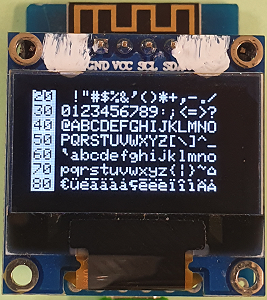
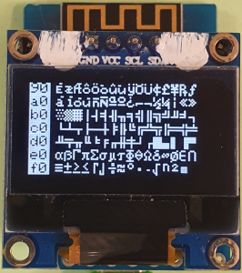

# D1 mini: Show CP437 8px-characters on OLED 0.96"
Version 2020-01-07 D1_oop65_oled096_cp437_allchar8.ino   
[German version](./LIESMICH.md "German version")   

This example shows all characters 32 ... 255 of the built in codepage CP437 font `fontKH_cp437_8x6` (8 pixel high) on an oled 0,96" (128x64 pixel).   
Special feature of built fonts: character 0x80 = 128 = &#x20AC; (= Euro, instead of &#xc7;)

       
_Figure 1: Character 32 to 143 (0x20..0x8F) and 144 to 255 (0x90..0xFF)_   

### Hardware
(1) WeMos D1 mini   
(2) One-color OLED 0.96" mounted on a proto shield (128x64 pixel, I2C-addr 0x3C)   

### Software
Uses files (classes) `D1_class_Screen096`, `OLEDDisplay`, `SSD1306Wire` and `OLEDDisplayFonts.h` (see directory `src\screen096`)   

__Software details__  
* Copy 16 (CP437-) characters into an array, convert chars to an Utf8-array and this array to a (Utf8-)string s1.   
* Convert the value of the start character of a line to HEX-string, write it inverted on display.   
* Write string s1 in this line using method `drawStringUsingCP437(x,y,s);`   
* Draw all 2 pages with 7 lines on OLED   

