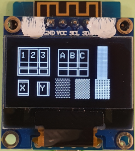

# D1 mini: Anzeige von 8px Textgrafikzeichen der Codepage CP437 OLED 0.96"
Version 2020-01-08 D1_oop65_oled096_cp437_textgraphic8.ino   
[English version](./README.md "English version")   

Nur aus Spa&szlig;: Dieses Beispiel zeichnet Rahmen mit Hilfe des eingebauten Codepage-CP437-Zeichensatzes `fontKH_cp437_8x6` (8 Pixel Zeichenh&ouml;he) auf ein OLED 0,96" (128x64 pixel).   
Spezialit&auml;t des eingebauten Zeichensatzes: Zeichen 0x80 = 128 = &#x20AC; (= Euro, statt &#xc7;)   

      
_Bild 1: Verschiedene Rahmen als Textgrafik gezeichnet_   

### Hardware
(1) WeMos D1 mini   
(2) Einf&auml;rbiges OLED 0.96" (128x64 pixel, I2C-addr 0x3C), montiert auf einem Protoboard (proto shield)    

### Software
Die Software verwendet die Dateien (Klassen) `D1_class_Screen096`, `OLEDDisplay`, `SSD1306Wire` und `OLEDDisplayFonts.h` (siehe Verzeichnis `src\screen096`)   
 
