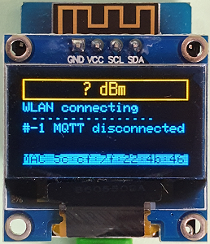
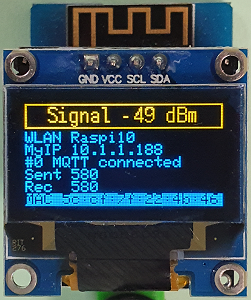

# D1 mini: Anzeige der MQTT Verbindungsdaten auf einem 0.96" OLED
Sketch: D1_oop67_mqtt2_oled096_test1.ino, Version 2019-12-25   
[English version](./README.md "English version")  

Das Programm verbindet sich über ein WLAN mit einem MQTT Server (Broker) und zeigt den Verbindungsaufbau sowie Verbindungszustand auf einem 0,96" OLED an. Nach erfolgreicher Verbindung wird in regelm&auml;ßigen Abst&auml;nden ein Z&auml;hlerstand an den Broker gesendet (Topic `oled096_test1`) und empfangene Werte werden auf dem OLED angezeigt.      
* Anzeige der MAC Adresse (Zeile 7, invertiert)   
* Versuch der Verbindung mit dem WLAN (SSID, Passwort).   
W&auml;hrend des Wartens werden Punkte auf dem OLED angezeigt (Zeile 3)   
* Anzeige des Names des verbundenen WLANS (= SSID) und der IP des D1minis bei erfolgreichem Verbindungsaufbau (Zeile 2 und 3)   
* Anzeige des Status der MQTT-Verbindung (Zeile 4)   
* Anzeige des an den MQTT-Brokers gesendeten Z&auml;hlerstandes (Topic `oled096_test1`, Zeile 5)   
* Anzeige der vom MQTT-Broker empfangenen Werte (gleiches Topic `oled096_test1`, Zeile 6)   

__* Wichtig*__: Das Beispiel ben&ouml;tigt einen MQTT-Broker!!   
Die Einstellung der WLAN-Daten und des MQTT-Brokers geschieht in der Zeile
```
MqttClientKH2 client("..ssid..", "..password..","mqtt server name");   
```

## Hardware 
1. WeMos D1 mini
2. one color OLED 0.96" mounted on a proto shield (128x64 pixel, I2C-address 0x3C)       

   
_Bild 1: D1mini verbindet sich mit dem MQTT-Broker_ 

   
_Bild 2: D1mini verbunden mit dem MQTT-Broker_ 


##Software
Die Klasse MqttClientKH2 erweitert die Klasse PubSubClient f&uuml;r eine einfache Verwendung von MQTT. Es k&ouml;nnen alle Befehle der Klasse PubSubClient verwendet werden.
Wenn die Bibliothek PubSubClient in der Arduino-IDE installiert ist, k&ouml;nnen die Dateien `PubSubClient.*` im Verzeichnis `/src/mqtt` gel&ouml;scht werden.

### Erstellen einer MQTT Anwendung
1. Setup eines Brokers  
ZB Installation von mosquitto auf einem Raspberry Pi und starten des Programms     
`sudo apt-get install mosquitto`   
`sudo apt-get install mosquitto-clients`   
`sudo /etc/init.d/mosquitto start`   
  `MqttClientKH2 client("..ssid..", "..password..","mqtt server name");`  
2. Erstellen eines Klienten auf den D1mini
* Klasse MqttClientKH2 einbinden   
  `#include "src/mqtt/D1_class_MqttClientKH2.h"`  
* Ein MqttClientKH2 Objekt erzeugen  
  `MqttClientKH2 client("..ssid..", "..password..","mqtt server name");`  
__*Nicht vergessen: Daten an das eigene Netzwerk anpassen!*__
* Eine **callback**-Funktion definieren, um die angemeldeten Topics zu verarbeiten.   
  `void callback(char* topic, byte* payload, unsigned int length)`  
Diese Funktion wird f&uuml;r alle angemeldeten Topics aufgerufen.   
* In der Funktion **`setup()`** wird das MQTT setup ausgef&uuml;hrt:  
  `client.addSubscribe("topic");` Anmelden eines Topics (= Input). Wird in callback() bearbeitet.   
  `client.addPublish("topic", "startvalue");` Ver&ouml;ffentlichen einer Nachricht mit dem gegebenen Topic.  
  `client.setCallback(callback);` Setzen des Namens der callback-Funktion.   
  `client.connectWiFiMQTT();` Herstellen einer Verbindung mit dem WLAN und MQTT-Server (Wartezeit max. 5 Sekunden).   
  ODER   
  durch den regelm&auml;&szlig;igen Aufruf von `client.isConnected()` in `loop()`   
  
* In der Hauptschleife **`loop()`**  
  Regelm&auml;&szlig;iger Aufruf von `client.isConnected()`, um die zyklische Abfrage des MQTT-Servers auszuf&uuml;hren (inklusive automatischer Wiederverbindung, falls die WLAN-Verbindung unterbrochen wurde).   
