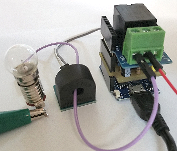
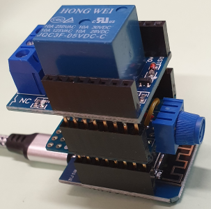

# D1 mini: Testing the class Relay1
Version 2020-01-03 D1_oop69_test_relay1.ino    
[German version](./LIESMICH.md "German version")   

For testing the class `Relay1` a D1 mini switches a
* relay on | toggle | off and afterwards a   
* lamp on | toggle | off. (In this case the switching depends on the measured current)   

The result of every action and the measured current are written to serial interface (COM) every 3 seconds.
```   
2020-01-03 D1_oop69_test_relay1
Set relay (1) on: changed - relay is now 1
470.00 mA
Toggle relay (1): changed - relay is now 0
452.00 mA
Set relay (0) off: NOT changed - relay is now 0
452.00 mA
--------------------------------------------
Current max: 2000.00
Current on:  100.00
--------------------------------------------
Set lamp (1) on: NOT changed, i = 452.00mA, Lamp is now ON
Toggle lamp (1): changed, I = 468.00mA, Lamp is now ON
Set lamp (1) off: changed - 452.00mA, Lamp is now ON
452.00 mA
452.00 mA
452.00 mA
452.00 mA
452.00 mA
-------------------E N D--------------------
```   

### Hardware
1. WeMos D1 mini
2. Relay shield
3. Current transformer ASM-010, a selfmade INA122 shield and a lamp to measure the current   
   OR - just for test - a potentiometer/trimmer at Analog In pin to simulate the current


   
_Figure 1: D1mini with selfmade shield INA122, relay shield, current transformer ASM-010 and a lamp_   

   
_Figure 2: D1mini with potenziometer and relay shield_   

### Software
The class `Relay1` can either
* switch a relay directly (on, off or toggle) or
* switch the lamp state (on, off or toggle).   
The difference is, that in this case the relay is switched depending on the current value. This may cause an error if current measuring is missing: A missing current measuring causes a value 0 at analog in. If the lamp is on and a command "lampOff" is given, the relay would not switch because the current "is already off".   

Note: The class `Relay1` uses the class `Ain` to read the (analog) current value.      

### Class diagram Relay1

| Class Relay1                    |             |
| ------------------------------- | ----------- |
| + Relay1();                     | Constructor (Default relay pin is D1) |   
| + Relay1(int pinRelais); |Constructor, sets the relay pin number |   
| + Relay1(int pinRelais, float imax_mA, float ion_mA); | Constructor, sets relay pin number, maximum current and current limit for state "current on" |   
| ~ void setup(int pin, float imax_mA, float ion_mA); | Sets relay pin number, maximum current and current limit for state "current on". Switches relay off. |   
| ~ void measuring();                  | measures mA_, sets lamp state lamp_ |   
| __*Setter-/Gettermethods*__ | <hr> |   
| bool   set(int val);                 | (tries to) switch lamp on or off |   
| bool   setPinRelay(int pin);         | set (new) relais pin  number |
| void   setParams(int pinRelais, float imax_mA, float ion_mA); | set (new) relais pin  number, maximum current and current limit for state "current on" |   
| void   setCurrentOn(float mA);       | current limit for "on" |   
| void   setCurrentMax(float mA);      | Maximum current =1023 AIN |   
| + bool   on(void);                     | Switch relay on (if not already switched on) |   
| + bool   off(void);                    | Switch relay off (if not already switched off) |   
| + bool   toggle();                     | Toggle relay |   
| + bool   lampOn(void);                 | Switch lamp on (if lamp is not already switched on = current is on) |   
| + bool   lampOff(void);                | Switch lamp off (if lamp is not already switched off = current off) |   
| + bool   lampToggle();                 | Toggle lamp (only if lamp state tells to do so) |   
| + bool   changed();                    | has relay/lamp state changed since last call (true=yes) |   
| + int    getRelaystate();              | relay state, can be 0 (=off) or 1 (=on) |   
| + int    getLampstate();               | lamp state, can be 0 (=off) or 1 (=on) |   
| + float  getCurrent();                 | lamp current [mA] |   
| + float  getCurrentOn();               | current limit for state "lamp on" |   
| + float  getCurrentMax();              | current limit for A/D converter value 1000 digit |   
| + String getsStatusOled();             | status text with max. 10 characters (e.g. for a 0.66" OLED |   
| + unsigned long getDuration();         | msec since last change |   

&nbsp;

|  *Properties*                   |                                            |   
| ------------------------------- | ------------------------------------------ |   
| ~ int   pinRelay_;              | relay pin number (default D1)              |   
| ~ int   relay_;                 | relay state = last output: 0=0V, 1=3V3     |   
| ~ int   lampstate_;             | lamp state depending on current measure (1=on, 0=off) |   
| ~ bool  changed_;               | was there a change of relay/lemp since last call of changed()  |   
| ~ float mA_;                    | actual current in mA   |   
| ~ float mA_max_;                | maximum current = 1000 digit AIN |   
| ~ float mA_lamp_on_;            | current limit for "on" |   
| ~ Ain   ain;                    | object to measure current |   
| ~ unsigned long lastMilli_;     | Milliseconds since last change of relay or lamp state |   
 

