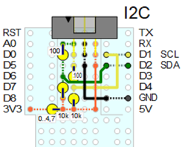

# D1 mini: Kleine H&uuml;ttensteuerung
Version 2020-02-10, Datei: D1_oop70_MQTT_DIO_oled066_hut_monitor.ino   
[English version](./README.md "English version")   

Dieses Projekt demonstriert die Ansteuerung von Sensoren mittels MQTT zB f&uuml;r eine kleine H&uuml;tte. Der D1 mini arbeitet dabei sowohl als MQTT-Client (Sender=Publisher und  Empf&auml;nger=Subscriber) als auch als Steuerung f&uuml; die Sensoren/Aktoren:   
* Messung von Temperatur, Luftfeuchtigkeit und Luftdruck innen und au&szlig;en mit zwei BME280 alle 2 Sekunden   
* Messung der Helligkeit innen und au&szlig;en mit zwei BH1750 alle 2 Sekunden   
* Bestimmung des Lampenzustands (ein|aus) und Messung des Stromes   
* &Uuml;berwachung des T&uuml;rzustands (offen|zu|versperrt)   
* Anzeige des Status (gemessene Werte, DIO) auf einem 0.66 Zoll OLED alle 2 Sekunden   

D1 mini als MQTT Publisher und Subscriber:
* Senden der Status-Information alle 10 Minuten   
* Abfrage der Broker-Zeit alle 15 Sekunden      
* Beantwortung von Anfragen wie "hut/get version" etc.   

__*Struktur der MQTT Nachrichten:*__   
* Anfragen: `hut/get [sGet]` und `hut/set/[sSet] _Wert_`   
* Antworten : `hut/ret/[sGet] _Wert_`   
* Spezialfall: Nach Senden des Topics `getTime` mit Payload `?` sollte der Broker mit dem Topic `brokertime` und der Payload `yyyymmdd HHMMSS` antworten   

_*Anmerkung*_: [sGet] bzw. [sSet] ist ein Wert aus den Feldern (arrays) sGet und sSet:   
[sGet] ... help, version, function, ip, all, state, door, lamp, current, current0, sensor, debug, time   
[sSet] ... lamp, sensor, current0, debug

Die Steuerung wird mit Hilfe einer Statemaschine realisiert (Zykluszeit 1 Minute: 600 States mit  0,1 sec)

   
_Bild 1: Blockschaltbild der H&uuml;ttensteuerung_   

### Hardware
1. WeMos D1 mini
2. Tripple-Protoboard mit selbsterstelltem 6-pin-I2C-Anschluss und 6-pin-IO-Anschluss   
   ODER   
   * Selbstbau I2C-Anschluss-Shield mit 6-pin-Stecker
   * Selbstbau DIO-Shield mit 6-pin-Stecker
3. Relay Shield (Pin ge&auml;ndert auf D5)   
4. Button Shield (D3)
5. Selbstbau INA122 Shield + Stromwandler ASM-010 zur Messung des Lampenstromes
6. OLED Shield 0.66" (64x48 pixel) 

   
_Bild 2: D1mini mit allen Shields f&uuml;r eine H&uuml;ttensteuerung_   

      
_Bild 3: Digital-IO f&uuml;r D1 mini_   

      
_Bild 4: I2C Anschluss beim D1 mini_   

   
_Bild 5: Praktische Ausf&uuml;hrung: D1mini Tripple-Protoboard mit 6-pin-I2C-Anschluss und 6-pin-IO-Anschluss_   

### Sensoren
1. BME280 (am I2C angeschlossen): SCL=D1, SDA=D2, GND, 3V3 (I2C-Adresse 0x76 und 0x77)
2. BH1750 (am I2C angeschlossen): SCL=D1, SDA=D2, GND, 3V3 (I2C-Adresse 0x23 und 0x5C)
3. 1x rote LED @ D8 (DOUT)
4. 1x (Reed-) Kontakt an D6 f&uuml;r Meldung T&uuml;re offen | geschlossen (DIN)
5. 1x (Reed-) Kontakt an D7 f&uuml;r Meldung T&uuml;re abgesperrt ja | nein (DIN)

### Software
Das Programm verwendet folgende Klassen:
* `Ain`: Analoger Eingang, Strommessung (wird von Klasse `Relay1` verwendet)
* `BH1750`: Messung der Helligkeit   
* `BME280`: Messung von Temperatur, Luftfeuchtigkeit und Luftdruck   
* `Din`: Erkennung einer fallenden Flanke des Tasters an D3
* `Door1`: Bearbeitung der T&uuml;rkontakte und der LED (leuchtet f&uuml;r eine bestimmte Zeit, wenn sich ein T&uuml;rkontakt-Zustand &auml;ndert)   
* `MqttClientKH2` (verwendet Klasse `PubSubClientmqtt2`): Verbindung zum WLAN und MQTT Broker
* `Relay1` (verwendet Klasse `Ain`): Schaltet das Relais (bzw. die Lampe) ein und aus und misst den Lampenstrom   
* `Screen1`: Anzeige von Temperatur, T&uuml;rstatus, Lampenstatus, Lampenstrom und Verbindungsstatus bzw. Datum und Uhrzeit auf dem OLED   
* `Statemachine`: Zeitlicher Ablauf (600 States mit je 0.1 sec Dauer)   