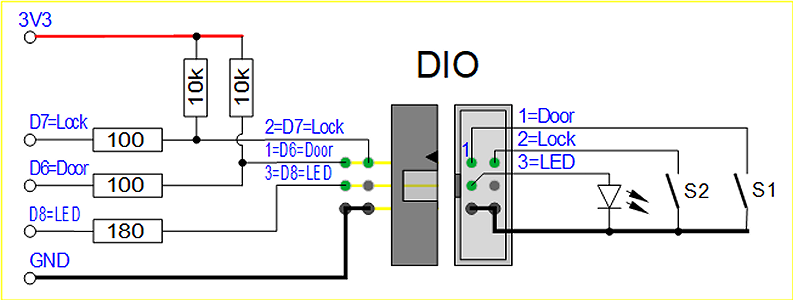
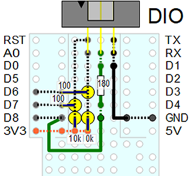
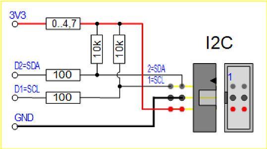

# D1 mini: Monitoring a little hut
Version 2020-02-10, File: D1_oop70_MQTT_DIO_oled066_hut_monitor.ino   
[German version](./LIESMICH.md "Deutsche Version")   

This project demonstrates how to control sensors via MQTT e.g. for a little hut. The D1 mini works as a MQTT client (subscriber and publisher) and controls the sensors as well:   
* Measure temperature, humidity and pressure indoor and outdoor with two BME280 every 2 seconds 
* Measure brightness indoor and outdoor with two BH1750 every 2 seconds   
* Measure lamp state and current (mA)   
* Watch a door state (open, close, lock)   
* Display status (measurement values, DIO) on an OLED 0.66" every 2 seconds   

Additional the D1 mini acts as a MQTT publisher and subscriber:
* Send state info every 10 minutes   
* Ask for brokertime every 15 seconds   
* React on commands like "hut/get version" etc.   

__*Structure of MQTT messages:*__   
* Requests: `hut/get [sGet]` and `hut/set/[sSet] _value_`   
* Answers : `hut/ret/[sGet] _value_`   
* Special : When D1mini sends topic `getTime` with payload `?` the broker should answer with topic `brokertime` and payload `yyyymmdd HHMMSS`   

_*Note*_: [sGet] or [sSet] is a value out of the arrays sGet and sSet:   
[sGet] ... help, version, function, ip, all, state, door, lamp, current, current0, sensor, debug, time   
[sSet] ... lamp, sensor, current0, debug

The timing is done by a state machine with cycle time 1 minute (600 states with 0.1 sec)

   
_Figure 1: Overview: D1mini for monitoring a hut_   

### Hardware
1. WeMos D1 mini
2. Tripple-Protoboard with selfmade 6-pin-I2C-connector and 6-pin-IO-connector   
   OR   
   * selfmade I2C-Connector shield with 6-pin-connector
   * selfmade DIO shield with 6-pin-connector
3. Relay shield (pin changed to D5)   
4. Button shield (D3)
5. selfmade INA122 shield + current transformer ASM-010 to meassure lamp current
6. OLED Shield 0.66" (64x48 pixel) 

   
_Figure 2: D1mini with all shields_   

      
_Figure 3: D1 mini - digital-IO_   

      
_Figure 4: D1 mini - I2C connection_   

   
_Figure 5: D1mini tripple shield with 6-pin-I2C-connector and 6-pin-IO-connector_   

### Sensors
1. BME280 connected to I2C: SCL=D1, SDA=D2, GND, 3V3 (I2C-address 0x76 and 0x77)
2. BH1750 connected to I2C: SCL=D1, SDA=D2, GND, 3V3 (I2C-address 0x23 and 0x5C)
3. 1x red LED @ D8 (DOUT)
4. 1x switch  @ D6 for door open | close (DIN)
5. 1x switch  @ D7 for lock yes | no (DIN)

### Software
The sofware uses the following classes:
* `Ain`: Analog In, measure the current (used by class `Relay1`)
* `BH1750`: Measure brightness   
* `BME280`: Measure temperature, humidity and pressure/altitude   
* `Din`: Detect falling edge of Button D3
* `Door1`: Control door inputs and led (led is on when door inputs change, automatic led off after some seconds)
* `MqttClientKH2` (uses class `PubSubClientmqtt2`): Connection to WLAN and MQTT broker
* `Relay1` (uses class `Ain`): Switch the relay (lamp) on or off and measure the current   
* `Screen1`: Show temperature, door state, lamp state, lamp current and connection state/date+time on OLED   
* `Statemachine`: timing (600 states with 0.1 sec each)   