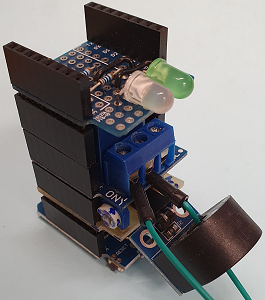

# D1 mini: Schalten einer Lampe &uuml;ber ein Relais mit MQTT
Version 2020-12-08 D1_oop77_smqtt_stm_relay1.ino    
[English version](./README.md "English version")   

Dieses Programm f&uuml;r einen D1 mini oder ESP32 D1mini dient zum Schalten eines Relais oder einer (AC) Lampe &uuml;ber MQTT und zum Messen des Stromes. Wenn der D1 mini ein Topic `relay1/set/relay` mit dem Inhalt (Payload) `on` empf&auml;ngt, schaltet er das Relais ein, mit `off` schaltet er es aus und mit `toggle` um.   
Die beiden Leds dienen dazu, den Systemstatus anzuzeigen:   
* DUO-LED rot: Nicht mit WLAN verbunden
* DUO-LED orange: Mit WLAN verbunden aber nicht mit dem MQTT Broker
* DUO-LED gr&uuml;n: MQTT Verbindung zum Broker OK.
* Die zweite (gr&uuml;ne) Led blinkt alle 2,5 Sekunden kurz auf, um anzuzeigen, dass der D1 mini funktioniert.   

__*Nicht vergessen: Die WLAN-Daten an das eigene Netzwerk anpassen*__ in der Zeile:   
`SimpleMqtt client("..ssid..", "..password..","mqtt server name");`  

    
_Bild 1: D1mini mit INA122- und Relais-Shield_   

### Hardware
1. WeMos D1 mini   
2. Relais Shield (D1)   
3. Selbstbau-Shield D1_INA122_V3 mit Stromwandler (zB ASM-010) am Analog-In-Eingang   
4. (gr&uuml;ne) LED an D8, Duo-LED an D6 (gr&uuml;n)/D7 (rot)   

### Details zu den MQTT-Nachrichten   
* Alle Topics f&uuml;r MQTT-Nachrichten an den D1 mini beginnen mit `relay/1/`   
* Alle MQTT-__Anfragen__ verwenden das selbe Topic `relay/1/get`, der Typ der gew&uuml;nschte Information wird in der Payload angegeben.   
*M&ouml;gliche Payloads sind im Array sGet[] definiert.*   
* Antworten auf Anfragen werden unter dem Topic `relay/1/ret/[sGet]` versendet, wobei [sGet] den Typ von Information darstellt. Die Payload enth&auml;lt das Ergebnis.   
* Befehle an den D1 mini verwenden das Topic `relay/1/set/[sSet]`, wobei [sGet] den Typ von Information darstellt. Die Payload enth&auml;lt den einzustellenden Wert.   
*M&ouml;gliche Payloads sind im Array sSet[] definiert.*   

__*Beispiele*__  
* Das Topic `relay/1/get` mit Inhalt (Payload) `help` ergibt die Antwort Topic `relay/1/ret/help` mit dem Inhalt (Payload) `get: help|version|ip|topicbase|eeprom|all|lamp|relay|current|current0|debug
set: topicbase|eeprom|relay|current0|debug`
* Das Topic `relay/1/set/relay` mit Inhalt (Payload) `on` ergibt die Antwort Topic `relay/1/ret/relay` mit dem Inhalt (Payload) `1` und schaltet das Relais ein.

### Test mit Mosquitto Publisher und Subscriber
1. Mit dem Wifi (WLAN) verbinden in dem sich der MQTT Server befindet.
2. In Windows oder Linux ein Konsolenfenster aufmachen und alle Nachrichten f&uuml;r den D1mini anzeigen (subscribe, anfordern):   
`mosquitto_sub -h 10.1.1.1 -t "relay/1/#" -v`  
3. In Windows oder Linux ein zweites Konsolenfenster aufmachen.   
Das Relais einschalten mit    
`mosquitto_pub -h 10.1.1.1 -t "relay/1/set/relay" -m on`  
Das Relais ausschalten mit    
`mosquitto_pub -h 10.1.1.1 -t "relay/1/set/relay" -m off`  
Das Relais umschalten mit    
`mosquitto_pub -h 10.1.1.1 -t "relay/1/set/relay" -m toggle`  

### Software
Dieses Besispiel verwendet die folgenden Dateien (Klassen):   
* `PubSubClient` und `D1_class_SimpleMqtt` (siehe Verzeichnis `src\simplemqtt`)   
* `D1_class_Relay2` , `D1_class_Relay2AC` und `D1_class_CurrentAC` (siehe Verzeichnis `src\relay2AC`)   
* `D1_class_Statemachine` (siehe Verzeichnis `src\statemachine`)   