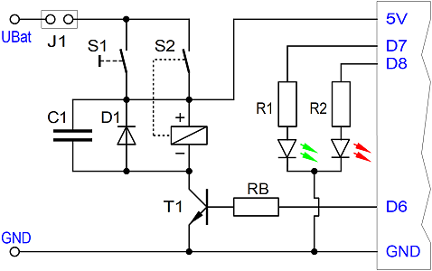
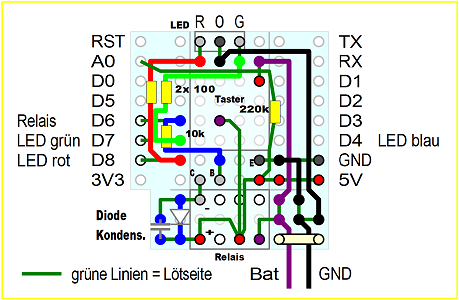

# D1 mini: MQTT Taster mit Halterelais
Sketch: D1_oop81_smqtt_holdPowerOn6_duoled78.ino, Version 2021-01-03   
[English version](./README.md "English version")  

Nach dem Drücken eines Tasters sendet der D1 mini eine MQTT-Nachricht, wartet auf die Antwort und zweigt diese mit Hilfe der eingebauten blauen LED an.   
Damit der "MQTT-Taster" möglichst lange mit Batterie betreiben werden kann, erfolgt die Stromversorgung über ein Relais.
Das Drücken des Tasters verbindet den D1 mini mit einem Akku (oder einer Batterie) und dieser hält über ein Relais die Verbindung mit der Versorgungsspannung, auch wenn der Taster wieder losgelassen wird (Selbsthalteschaltung).   

__Im Detail passiert folgendes:__   
Sofort nach dem Start setzt der D1 mini den Pin D6 auf 3,3V, um die Selbsthaltung zu aktivieren. Danach setzt er die Duo-LED auf rot und verbindet sich mit dem Netzwerk und dem MQTT-Broker.   
Gelingt dies, leuchtet die Duo-LED orange und der D1 mini
* ver&ouml;ffentlicht das Topic `info/start` mit der Payload `button/1`
* ver&ouml;ffentlicht das Topic `led/1/set/blueled` mit der Payload `-1`   
* ver&ouml;ffentlicht das Topic `button/1/ret/voltage` mit der Payload 0 bis 100 [%]

Danach wartet der D1 mini maximal 6 Sekunden auf das Eintreffen des Topics `led/1/ret/blueled` mit der Payload "off" (0) oder "on" (1). Das Ergebnis wird mit Hilfe der blauen LED angezeigt:   
* Kommt keine Antwort, blinkt die blaue LED für drei Sekunden schnell (1:1).   
* Ist die Antwort 0, blinkt die blaue LED zweimal mit kurzen Impulsen (1:12).   
* Ist die Antwort 1, blinkt die blaue LED zweimal mit langen Impulsen (12:1).   

Anschließend schaltet der D1 mini das Relais ab (D6 auf 0) und geht sicherheitshalber für eine Stunde in einen Tiefschlaf (falls der Taster hängt oder absichtlich zu lange gedrückt wird).

__Anmerkungen:__
* Die Klasse `SimpleMqtt` erweitert die Klasse `PubSubClient` für eine noch einfachere Anwendung.   
* Alle Methoden der Klasse `PubSubClient` können weiterhin verwendet werden.   
* Wenn die PubSubClient Bibliothek auf den Rechner installiert ist, können die beiden PubSubClient-Dateien im Verzeichnis src/simplemqtt gelöscht werden.   

__*Wichtig*__   
* Zum Testen sollte ein zweiter D1 mini zB mit dem Programm `D1_oop75_smqtt_eeprom_blueled1` verwendet werden. (Damit man das Schalten der anderen LED sieht und eine MQTT-Antwort erhält.)
* Das Beispiel ben&ouml;tigt einen MQTT-Broker!!

### Hardware 
1. WeMos D1 mini   
2. Protoboard "Powerhold"   
   
_Bild 1: D1mini mit PowerHold-Protoboard_ 

## Protoboard "Powerheld"
### Schaltung
* Der Taster S1 ist mit der Batterie und dem 5V-Eingang des D1 mini verbunden.
* Der Ausgang D6 ist über einen 10k&#8486;-Widerstand RB mit der Basis eines Transistors T1 (zB BC548) verbunden, der das Relais S2 (3,3V IM01) schaltet.
* Ein (Umschalt-)Kontakt des Relais S2 ist mit der Batterie und der 5V-Versorgung des D1 mini verbunden (parallel zum Taster S1)
* Parallel zur Spule des Relais ist eine Freilaufdiode (zB 1N4148) und ein Kondensator C1 (100nF...1µF) geschaltet.
* D7 ist über einen Vorwiderstand R1 (100&#8486;) mit dem "grünen" Anschluss einer 3-Pin-Duo-LED verbunden.
* D8 ist über einen Vorwiderstand R2 (100&#8486;) mit dem "roten" Anschluss einer 3-Pin-Duo-LED verbunden.
* Zusätzlich ist der 5V-Anschluss über einen 220k&#8486;-Widerstand mit A0 verbunden, um die Versorgungsspannung messen zu können.

   
_Bild 2: Schaltung D1mini mit Halterelais, Taster und Duo-LED_ 

### Schematischer Aufbau auf dem Protoboard
   
_Bild 3: Aufbau der PowerHold-Schaltung auf dem Protoboard_ 

