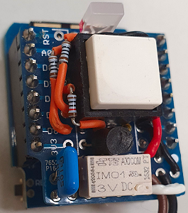

# D1 mini: MQTT push button with holding relay
Sketch: D1_oop81_smqtt_holdPowerOn6_duoled78.ino, version 2021-01-03   
[--> Deutsche Version](./LIESMICH.md "Deutsche Version")   

After pressing a button, the D1 mini sends an MQTT message, waits for the answer and displays it with the help of the built-in blue LED.   
To ensure that the "MQTT push button" can be operated on battery power for as long as possible, the power supply is provided by a relay.
Pressing the button connects the D1 mini to an accumulator (or battery) and this keeps the connection to the supply voltage via a relay, even if the button is released again (self-holding circuit).   

__In detail the following happens:__   
Immediately after startup, the D1 mini sets pin D6 to 3.3V to enable latching. Then it sets the Duo LED to red and connects to the network and the MQTT broker.   
If this succeeds, the Duo LED lights up orange and the D1 mini
* publishes the topic `info/start` with the payload `button/1`
* publishes the topic `led/1/set/blueled` with the payload `-1`   
* publishes the topic `button/1/ret/voltage` with the payload 0 to 100 [%]

After that the D1 mini waits maximum 6 seconds for the arrival of the topic `led/1/ret/blueled` with the payload "off" (0) or "on" (1). The result is indicated by the blue LED:   
* If there is no response, the blue LED flashes rapidly for three seconds (1:1).   
* If the answer is 0, the blue LED flashes twice with short pulses (1:12).   
* If the response is 1, the blue LED flashes twice with long pulses (12:1).   

Then the D1 mini switches off the relay (D6 to 0) and goes into a deep sleep for one hour to be on the safe side (in case the button hangs or is pressed too long on purpose).

__Notes:__
* The class `SimpleMqtt` extends the class `PubSubClient` for an even easier usage.   
* All methods of the `PubSubClient` class can still be used.   
* If the PubSubClient library is installed on the computer, the two PubSubClient files in the src/simplemqtt directory can be deleted.   

__*Important*__   
* For testing a second D1 mini should be used e.g. with the program `D1_oop75_smqtt_eeprom_blueled1`. (So that you can see the switching of the other LED and get a MQTT response).
* The example needs a MQTT broker!!!

### Hardware 
1. WeMos D1 mini   
2. protoboard "Powerhold"   
   
_Fig. 1: D1mini with PowerHold-Protoboard_ 

## Protoboard "Powerheld
### Circuit
* Pushbutton S1 is connected to the battery and the 5V input of the D1 mini.
* Output D6 is connected to the base of a transistor T1 (e.g. BC548) via a 10k&#8486;resistor RB, which switches relay S2 (3.3V IM01).
* A (change-over) contact of the relay S2 is connected to the battery and the 5V supply of the D1 mini (in parallel to the pushbutton S1).
* A free-wheeling diode (e.g. 1N4148) and a capacitor C1 (100nF...1µF) are connected in parallel to the coil of the relay.
* D7 is connected via a series resistor R1 (100&#8486;) to the "green" terminal of a 3-pin duo LED.
* D8 is connected via a series resistor R2 (100&#8486;) to the "red" terminal of a 3-pin duo LED.
* Additionally, the 5V terminal is connected to A0 via a 220k&#8486; resistor to be able to measure the supply voltage.

   
_Fig. 2: D1mini circuit with holding relay, pushbutton and Duo-LED_ 

### Schematic layout on the protoboard
   
_Fig. 3: Structure of the PowerHold circuit on the protoboard_ 

