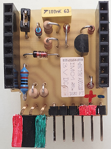
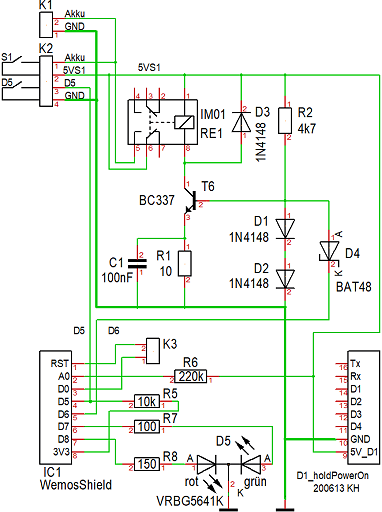

# D1 mini: MQTT T&uuml;r&uuml;berwachung mit Halterelais
Sketch: P1_oop82_smqtt_door5_holdPowerOn6.ino, Version 2021-01-09   
[English version](./README.md "English version")   
Mit Hilfe des Selbstbau-Shields "D1_holdPowerOn" h&auml;lt sich ein batteriebetriebener D1 mini nach einem Startimpuls an der Versorgungsspannung und sendet den Zustand des Pins D5 &uuml;ber MQTT an einen Broker. Danach kontrolliert er, ob die Nachricht vom Broker weitergesendet wurde und zeigt das Ergebnis &uuml;ber eine Duo-LED an.   

Das System kann dazu verwendet werden, den Zustand einer T&uuml;re zu melden:   
* Beim &Ouml;ffnen/Schlie&szlig;en der T&uuml;re wird ein Kontakt S1 bet&auml;tigt, der den D1 mini startet.   
* Der Zustand der T&uuml;re wird z.B. mit einem Reedkontakt an D5 (gegen Masse) erfasst: 1=Türe offen, 0=Türe geschlossen.   

__Im Detail passiert folgendes:__   
1. Nach dem Programmstart setzt der D1 mini Pin D6 auf "1" (3V3), um die Selbsthaltung sicherzustellen.   
2. Der D1 mini setzt die Duo-LED auf rot und verbindet sich mit dem Netzwerk und dem MQTT-Broker.   
3. Gelingt dies, leuchtet die Duo-LED orange und der D1 mini
* ver&ouml;ffentlicht das Topic `info/start` mit der Payload `door/1`
* ver&ouml;ffentlicht das Topic `door/1/ret/status` mit der Payload `0` oder `1` je nach Zustand von Pin D5   
* ver&ouml;ffentlicht das Topic `door/1/ret/voltage` mit der Payload 0 bis 100 [%]   
4. Der D1 mini zeigt den Zustand von D5 durch Blinken der LED an:   
* D5=1 LED blinkt lange Impulse (9:1)   
* D5=0 LED blinkt kurze Impulse (1:9)   
5. Empf&auml;ngt der D1 mini das von ihm selbst ausgesendete Topic `door/1/ret/status`, blinkt die LED gr&uuml;n
6. &Auml;ndert sich der Zustand von D5, wird eine weitere Status-Nachricht ausgesendet.
7. Nach 12 Sekunden schaltet der D1 mini das Relais ab (D6 auf 0).   
   Sollte dies nicht gelingen, geht der D1 mini für eine Stunde in Tiefschlaf und startet dann wieder.   
   (Alternativ: Sollte dies nicht gelingen, blinkt die rote LED alle 10 Sekunden kurz auf. Weiters wird alle 8 Stunden eine Nachricht mit dem Batteriestand gesendet.)   

__Anmerkungen__
* Die Klasse `SimpleMqtt` erweitert die Klasse `PubSubClient` zur einfachen Anwendung.   
* Alle Methoden der Klasse `PubSubClient` k&ouml;nnen weiterhin verwendet werden.   
* Wenn die PubSubClient Bibliothek auf den Rechner installiert ist, k&ouml;nnen die beiden PubSubClient-Dateien im Verzeichnis src/simplemqtt gel&ouml;scht werden.   

__*Nicht vergessen: Die WLAN-Daten an das eigene Netzwerk anpassen*__ in der Zeile:   
`SimpleMqtt client("..ssid..", "..password..","mqtt server name");`   

__*Wichtig*__   
* Das Beispiel ben&ouml;tigt einen MQTT-Broker!!

### Hardware 
1. WeMos D1 mini   
2. Selbstbau Prototype Shield "D1_holdPowerOn" mit 3-poliger Duoled   
   
   
_Bild 1: D1-holdPowerOn Shield_   
   
      
_Bild 2: Schaltung des holdPowerOn Shields_   
