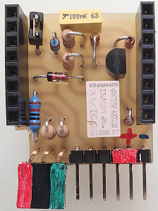

# D1 mini: MQTT door monitoring with holding relay
Sketch: P1_oop82_smqtt_door5_holdPowerOn6.ino, Version 2021-01-09   
[--> Deutsche Version](./LIESMICH.md "Deutsche Version")   
With the help of the do-it-yourself shield "D1_holdPowerOn", a battery-powered D1 mini connects to the supply voltage after a start pulse and sends the state of pin D5 to a broker via MQTT. It then checks whether the message has been forwarded by the broker and displays the result via a Duo LED.   

The system can be used to report the state of a door:   
* When opening/closing the door, a contact S1 is actuated, which starts the D1 mini.   
* The status of the door is detected, for example, with a reed contact at D5 (to ground): 1=door open, 0=door closed.   

__In detail the following happens:__   
1. after the program start the D1 mini sets pin D6 to "1" (3V3) to ensure the self-holding.   
2. the D1 mini sets the Duo LED to red and connects to the network and the MQTT broker.   
3. if this succeeds, the Duo LED lights up orange and the D1 mini
* publishes the topic `info/start` with the payload `door/1`.
* publishes the topic `door/1/ret/status` with the payload `0` or `1` depending on the state of pin D5   
* publishes the topic `door/1/ret/voltage` with the payload 0 to 100 [%].    
4. the D1 mini indicates the state of D5 by flashing the LED:   
* D5=1 LED flashes long pulses (9:1).   
* D5=0 LED flashes short pulses (1:9)   
5. if the D1 mini receives the topic 'door/1/ret/status' sent by itself, the LED flashes at a higher rate
6. if the status of D5 changes, another status message is sent.
7. after 12 seconds the D1 mini switches off the relay (D6 to 0).   
   If this fails, the D1 mini will go into deep sleep for one hour and then restart.   
   (Alternatively: If this does not succeed, the red LED flashes briefly every 10 seconds. Furthermore, a message with the battery status is sent every 8 hours).   
   
__Notes__
* The `SimpleMqtt` class extends the `PubSubClient` class for easy use.   
* All methods of the `PubSubClient` class can still be used.   
* If the PubSubClient library is installed on the computer, the two PubSubClient files in the src/simplemqtt directory can be deleted.   

__*Don't forget to change WiFi data to your network values*__ in line   
`SimpleMqtt client("..ssid..", "..password..","mqtt server name");`  

__*Important*__   
* The example requires an MQTT broker!!!

### Hardware 
1. WeMos D1 mini   
2. self-made Prototype Shield "D1_holdPowerOn" with 3-pole Duoled   

   
_Figure 1: D1-holdPowerOn Shield_   
   
      
_Figure 2: Circuit of the holdPowerOn Shield_   

