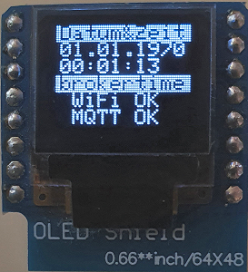
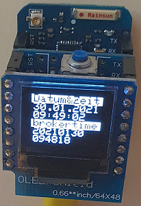

# D1 mini: (LINUX-) Sekundenz&auml;hler mit Anzeige auf 0,66"-OLED
Sketch: D1_oop84_smqtt_oled66_but3_clock1.ino, Version 2021-01-30   
[--> English version](./README.md "English version")   

Dieses Programm f&uuml;r einen D1 mini (oder ESP32 D1mini) z&auml;hlt Sekunden und zeigt den Wert als Datum und Uhrzeit auf einem 0,66"-OLED an.   
* Das Programm verbindet sich &uuml;ber das WLAN mit dem angegebenen MQTT-Broker.   
* Wird die Taste D3 gedr&uuml;ckt, so sendet der D1mini eine MQTT-Nachricht (Topic `getTime`, Payload `?`) an den Broker.   
* Wird eine Nachricht mit dem Topic `brokertime` empfangen, so wird die Payload (Format `YYYYmmdd HHMMSS`) dazu verwendet, Datum und Uhrzeit zu aktualisieren.   
* Kann keine Verbindung mit dem Netzwerk bzw. Broker hergestellt werden, wird die Zeit nur zirka alle 8 Sekunden aktualisiert (= Default-Wartezeit in der Klasse `SimpleMqtt` auf die Netzwerkverbindung).   

Zus&auml;tzlich sind folgende Funktionen verf&uuml;gbar:
* Automatische (eingebaute) Beantwortung der Anfragen   
  `-t oop84/get -m Hilfe`   
  `-t oop84/get -m version`   
  `-t oop84/get -m ip`   
  Die Antwort erfolgt als MQTT-Nachricht der Form `oop84/ret/...`   
* Beantwortung folgender Anfragen   
  `-t oop84/get -m topicbase`   
  `-t oop84/get -m eeprom`   
Die Antwort erfolgt ebenfalls als MQTT-Nachricht der Form `oop84/ret/...`   
* Setzen einer neuen Topic-Basis, die auch im EEPROM gespeichert wird:   
  `-t oop84/set/topicbase -m new_base`
* L&ouml;schen der im EEPROM gespeicherten Topicbase. Beim Neustart wird dann die Vorgabe-Topicbase verwendet.   
  `-t oop84/set/eeprom -m erase`   

__Anmerkungen__
* Die Klasse `SimpleMqtt` erweitert die Klasse `PubSubClient` zur einfachen Anwendung.   
* Alle Methoden der Klasse `PubSubClient` k&ouml;nnen weiterhin verwendet werden.   
* Wenn die PubSubClient Bibliothek auf den Rechner installiert ist, k&ouml;nnen die beiden PubSubClient-Dateien im Verzeichnis src/simplemqtt gel&ouml;scht werden.   

__*Nicht vergessen: Die WLAN-Daten an das eigene Netzwerk anpassen*__ in der Zeile:   
`SimpleMqtt client("..ssid..", "..password..","mqtt server name");`   

__*Wichtig*__   
* Das Beispiel ben&ouml;tigt einen MQTT-Broker!!

### Hardware 
1. WeMos D1 mini   
2. (Selbstgebautes) Button Shield D3 (oder Button am D3)
3. OLED-Schild: 0,66", SSD1306, 64x48 Pixel, I2C
   
   
_Bild 1: Anzeige von oop84 nach Verbinden mit dem MQTT-Server und vor dem ersten Tastendruck_   

   
_Bild 2: D1mini mit (Selbstbau-)Button-Shield und 0.66" OLED_   
