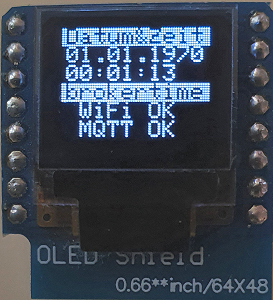
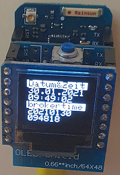

# D1 mini: (LINUX-) second counter with display on 0.66"-OLED
Sketch: D1_oop84_smqtt_oled66_but3_clock1.ino, Version 2021-01-30   
[--> Deutsche Version](./LIESMICH.md "Deutsche Version")   

This programme for a D1 mini (or ESP32 D1mini) counts seconds and displays the value as date and time on a 0.66" LED.   
* The programme connects to the specified MQTT broker via the WLAN.   
* If the D3 key is pressed, the D1mini sends an MQTT message (Topic `getTime`, Payload `?`) to the broker.   
* If a message with the topic `brokertime` is received, the payload (format `YYYYmmdd HHMMSS`) is used to update the date and time.   
* If no connection with the network or broker can be established, the time is only updated approximately every 8 seconds (= default waiting time in the class `SimpleMqtt` for the network connection).   

In addition, the following functions are available:
* Automatic (built-in) answering of requests   
  `-t oop84/get -m help`   
  `-t oop84/get -m version`   
  `-t oop84/get -m ip`   
  The response is a MQTT message of the form `oop84/ret/...`.   
* Reply to the following requests   
  `-t oop84/get -m topicbase`   
  `-t oop84/get -m eeprom`   
The response will also be a MQTT message of the form `oop84/ret/...`.   
* Set a new topic base, which is also stored in the EEPROM:   
  `-t oop84/set/topicbase -m new_base`
* Delete the topic base stored in the EEPROM. When restarting, the default topicbase will be used.   
  `-t oop84/set/eeprom -m erase`   

__Notes__
* The class `SimpleMqtt` extends the class `PubSubClient` for easy use.   
* All methods of the class `PubSubClient` can still be used.   
* If the PubSubClient library is installed on the computer, the two PubSubClient files in the src/simplemqtt directory can be deleted.   

__*Don't forget: Adapt the WLAN data to your own network*__ in the line:   
`SimpleMqtt client("..ssid..", "..password..", "mqtt server name");`   

__*Important*__   
* The example requires an MQTT broker!!!

### Hardware 
1. WeMos D1 mini   
2. (Self-made) Button Shield D3 (or button on D3)
3. OLED sign: 0.66", SSD1306, 64x48 pixels, I2C
   
   
_Fig. 1: Display of oop84 after connecting to the MQTT server and before the first keystroke_   

   
Picture 2: D1mini with (self-made) button shield and 0.66" OLED_   
