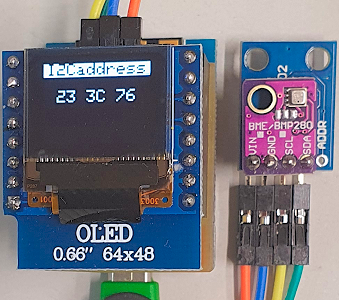

# D1 mini: Anzeige von I2C-Adressen
Sketch: D1_oop85_oled66_I2c_detect.ino, Version 2021-02-02   
[--> English version](./README.md "English version")   

Dieses Programm f&uuml;r einen D1 mini (oder ESP32 D1mini) scannt alle 5 Sekunden den I2C-Bus von Adresse 0x03 bis 0x77 und zeigt die gefundenen Adressen sowohl auf dem 0,66"-Display als auch &uuml;ber die serielle Schnittstelle (115200Bd) an.

__Ausgabe des Programms__
```
setup(): --Start--
I2C, display OK
setup(): --Finished--

Scanning i2c 7-bit-addresses 0x03 to 0x77...
23 3C 76 
Scanning i2c 7-bit-addresses 0x03 to 0x77...
23 3C 76 
```

### Hardware 
1. WeMos D1 mini oder ESP32 D1 mini   
2. Adapter f&uuml;r I2C Bus
3. OLED Shield: 0.66", SSD1306, 64x48 pixel, I2C @ 0x3C
4. Weitere I2C Sensoren (0x3C ist das OLED Shield)

       
_Bild 1: Anzeige der gefundenen I2C Adressen_   
