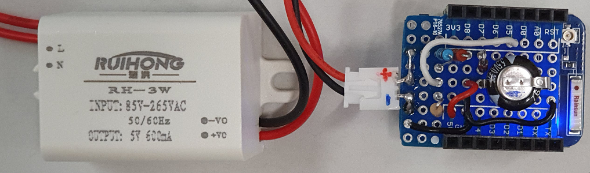
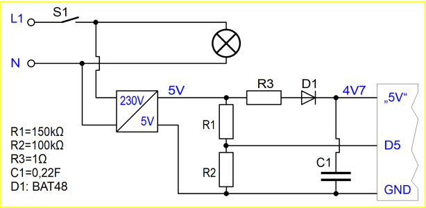

# D1 mini: 230V Spannungs&uuml;berwachung mit MQTT Meldung
Sketch: D1_oop87_smqtt_voltagemonitoring1.ino, Version 2021-02-20   
[--> English Version](./README.md "English Version")   

Nach dem Einschalten der Spannungsversorgung sendet der D1 mini die MQTT-Meldung `voltage/1/ret/status` mit payload `1`. Wird die Versorgungsspannung abgeschaltet, sendet er die gleiche Meldung mit Payload `0`.   
Im DEBUG-Modus wird zus&auml;tzlich die Zeit gemessen, bis die Nachricht gesendet wird und weiters, bis dieselbe Nachricht wieder beim D1mini ankommt (meist 52ms bzw. 104ms). Die Anzeige der Werte erfolgt &uuml;ber die serielle Schnittstelle (115200Bd).   

**Beispiel f&uuml;r die MQTT-Meldungen**   
Die Versorgungsspannung wird eingeschaltet und nach einiger Zeit wieder abgeschaltet.   
```
info/start voltage/1
voltage/1/ret/status 1
voltage/1/ret/status 0
```

## Hardware
1. WeMos D1 Mini oder ESP32 D1 mini   
2. 5V-Spannungsversorgung mit Spannungsteiler, Diode und St&uuml;tzkondensator   

   
_Bild 1: 230V/5V-Netzteil und D1 mini mit Spannungs&uuml;berwachungs-Shield_   

## Spannungs&uuml;berwachungs-Shield
### Schaltung
   
_Bild 2: Schaltung des Spannungs&uuml;berwachungs-Shields_   

### Dimensionierung
#### Widerst&auml;nde
F&auml;llt die Versorgungsspannung unter 4,5V, so soll D5=0 werden. Dies passiert bei einer Eingangsspannung kleiner als 1,6V:   
Uin = 4,5V, UR2 = 1,6V -> UR1 = Uin - UR2 = 2,9V   
Dies ergibt f&uuml;r das Verh&auml;ltnis der Widerst&auml;nde:   
R1:R2 = 2,9:1,6 = 1,81:1   
__Gew&auml;hlt: R2 = 100k&Omega;, R1 = 150k&Omega;__   

Der Widerstand R3 dient zur Strombegrenzung beim Einschalten (Ladestrom f&uuml;r C1):   
__Gew&auml;hlt: Widerstand R3 = 1 &Omega;__   

#### Absch&auml;tzung f&uuml;r C1   
Annahmen:   
* Der Stromverbrauch des D1 mini betr&auml;gt zwischen 70mA und 120mA.   
* Die Zeit vom Erkennen des Spannungsabfalles bis zum Ende des Sendens der MQTT-Nachricht betr&auml;gt ca. 52ms, bzw. bis zum Wieder-Eintreffen der Nachricht beim D1 mini 104ms.   
* Der Kondensator wird auf ca. 4,7V aufgeladen.   

Eine grobe Absch&auml;tzung kann &uuml;ber die ben&ouml;tigte elektrische Ladung zum Weiterlaufen des D1 mini erfolgen (Verwendung von statischen Werten statt der realen Zeitverl&auml;ufe):   
Q = C * U = I * t   
C = I * t / U = 120mA * 104ms / 4,7V = 0,12 * 0,104 / 4,7 = 2,7 mF = 2700&micro;F   
Versuche zeigen, dass ein 3300&micro;F Kondensator ausreicht. Sicherheitshalber wird ein Gold-Cap __Kondensator 0,22F/5,5V__ gew&auml;hlt.   
