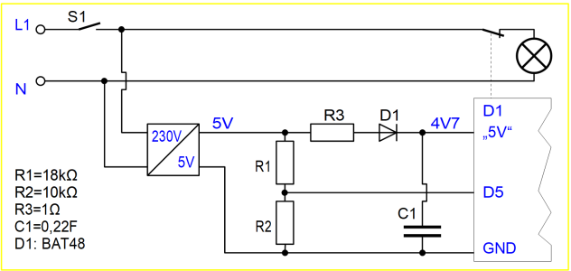

# D1 mini: 230V Spannungs&uuml;berwachung mit Ausschaltung und MQTT Meldung
Sketch: D1_oop88_smqtt_voltagemonioff1.ino, Version 2021-02-14   
[--> English Version](./README.md "English Version")   

Nach dem Einschalten der Spannungsversorgung sendet der D1 mini die MQTT-Meldung `voltage/1/ret/status` mit payload `1`. Wird die Versorgungsspannung abgeschaltet, sendet er die gleiche Meldung mit Payload `0`.   
Zus&auml;tzlich besteht die M&ouml;glichkeit, die Verbraucherspannung &uuml;ber MQTT aus- und einzuschalten. Zum Wiedereinschalten mit dem Hauptschalter muss dieser lediglich einmal kurz aus- und dann wieder eingeschaltet werden (Reset des D1 mini).

__*Praktische Anwendung*__   
Ist zB f&uuml;r das Schalten des Lichts im Bad oder WC nur ein Ein-/Ausschalter (kein Wechselschalter) vorgesehen und wird &ouml;fters auf das Ausschalten des Lichtes vergessen, so kann mit dieser Schaltung ein Fernabschalten vorgenommen werden. Weiters w&auml;re es auch m&ouml;glich, zB durch einen zus&auml;tzlichen Bewegungsmelder, das Licht nach einer l&auml;ngeren Ruhephase automatisch abzuschalten.   

**Beispiel f&uuml;r MQTT-Meldungen**   
Die Versorgungsspannung wird eingeschaltet, das Relais mit dem MQTT-Befehl `mosquitto_pub -h 10.1.1.1 -t voltage/1/set/relay -m -1` dreimal umgeschaltet und danach wieder abgeschaltet.   
```
info/start voltage/1
voltage/1/ret/status 1
voltage/1/set/relay -1
voltage/1/ret/relay consumer off
voltage/1/ret/status 0
voltage/1/set/relay -1
voltage/1/ret/relay consumer on
voltage/1/ret/status 1
voltage/1/set/relay -1
voltage/1/ret/relay consumer off
voltage/1/ret/status 0
voltage/1/ret/status 0
```

## Hardware
1. WeMos D1 Mini oder ESP32 D1 mini   
2. 5V-Spannungsversorgung mit Spannungsteiler, Diode und St&uuml;tzkondensator   
3. D1 mini Relais-Shield (mit Default Pin D1)

## Spannungs&uuml;berwachungs-Shield
### Schaltung
   
_Bild 1: Schaltung der Spannungs&uuml;berwachung mit Abschaltm&ouml;glichkeit_   
