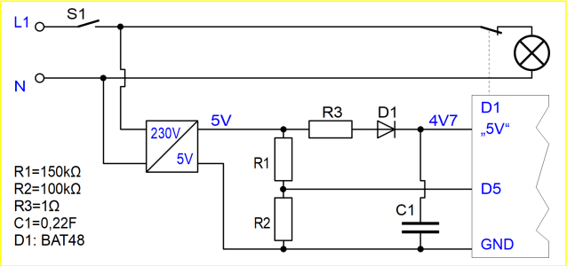
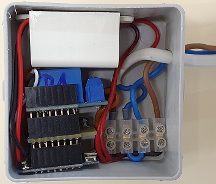
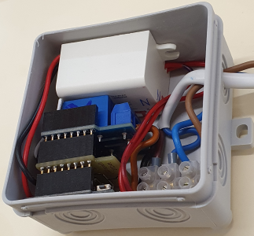

# D1 mini: 230V voltage monitoring with switch-off and MQTT message
Sketch: D1_oop88_smqtt_voltagemonioff1.ino, Version 2021-02-20   
[--> Deutsche Version](./LIESMICH.md "Deutsche Version")   

After switching on the power supply, the D1 mini sends the MQTT message `voltage/1/ret/status` with payload `1`. If the supply voltage is switched off, it sends the same message with payload `0` or `2` (if the relay was energised at the time of switch-off, i.e. the consumer was switched off).   
In addition, it is possible to switch the consumer voltage off and on via MQTT. To switch on again with the main switch, it only has to be switched off once and then switched on again (reset of the D1 mini).

__*Practical application*__   
If, for example, only one on/off switch (not a changeover switch) is provided for switching the light in the bathroom or WC and if the light is often forgotten to be switched off, this circuit can be used to switch it off remotely. Furthermore, it would also be possible, e.g. by means of an additional motion detector, to automatically switch off the light after a longer period of rest.   

**Example for MQTT messages**   
The supply voltage is switched on, the relay is switched three times with the MQTT command `mosquitto_pub -h 10.1.1.1 -t voltage/1/set/relay -m -1` and then switched off again. This results in the following MQTT messages:   
```
info/start voltage/1
voltage/1/ret/status 1
voltage/1/set/relay -1
voltage/1/ret/relay 1
voltage/1/ret/status 0
voltage/1/set/relay -1
voltage/1/ret/relay 0
voltage/1/ret/status 1
voltage/1/set/relay -1
voltage/1/ret/relay 1
voltage/1/ret/status 0
voltage/1/ret/status 0
```

## Hardware
1. WeMos D1 Mini or ESP32 D1 mini
2. 5V power supply with voltage divider, diode and backup capacitor
3. D1 mini relay shield (with default pin D1)

## Voltage Monitoring Shield
### Circuit
   
_Figure 1: Circuit of the voltage monitoring with switch-off option_   

## Structure of the voltage monitoring system   
For the practical set-up of the voltage monitoring, you need a junction box of at least 75 x 75 x 40 mm3 (see figure 2). At the top left you can see the 5V power supply (white rectangle) and below is the D1mini with 5V monitor shield and relay shield.   

    
Figure 2: Installation of the voltage monitor in a junction box 75x75x40mm3_   
