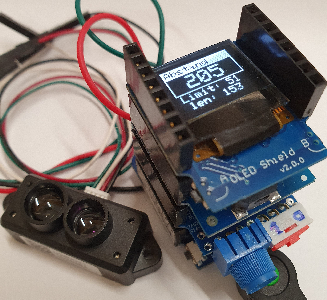
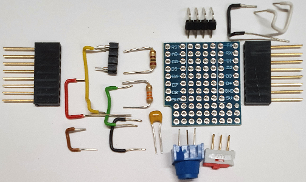

# D1 mini: Entfernungsmessung mit LIDAR TFmini und Anzeige auf OLED 0,66"
Sketch: D1_oop98_tf02pro_oled66_1.ino, Version 24.11.2021   
[--> English Version](./README.md "English Version")   

## Funktion
Dieses Programm für den D1 mini oder ESP32mini (ESP32-WROOM-32) macht folgendes:   
1. Periodisches Einlesen der TFmini-Daten über die serielle Schnittstelle und Berechnung der Entfernung (in cm).   
2. Anzeige der Entfernung auf einem Display (OLED 0,66").   
3. Ausgabe einer Melodie, falls ein Mindestabstand (Limit) unterschritten wird.   
4. Einstellen des Limit-Wertes mit Hilfe eines Potenziometers. (Einlesen als Analogwert)   

## Erforderliche Hardware
1. D1 mini oder ESP32mini (ESP32-WROOM-32)   
2. Selbstbau TF-Adapter-Shield: Potenziometer zur Eingabe des Analogwertes, Stifte für den LIDAR-Anschluss (TFmini oder TF02)   
3. Buzzer-Shield @ D5 (GPIO18)   
4. OLED 0.66" Shield @ I2C   
5. LIDAR TFmini (0,1m bis 12m) oder TF02 (0,1m bis 40m)   

   
_Bild 1: Entfernungsmessung mit LIDAR TFmini_   

## Selbstbau TF-Adapter-Shield
Das Selbstbau TF-Adapter-Shield enthält   
* ein Potenziometer zur Eingabe des Analogwertes,   
* einen Spannungsteiler für die RXD-Leitung (falls man von einem LIDAR ein 5V-Signal erhält)   
* einen Schalter, um die RXD-Leitung vom RXD-Pin zu trennen (während des Programmiervorganges wichtig ;) )
* Stifte für den LIDAR-Anschluss (5V RXD TXD GND)   

   
_Bild 2: Bauteile für den TF-Adaper-Shield_   

   
_Bild 3: Bestücktes TF-Adaper-Shield_   


## Programm-Details
### Prozessor-spezifische Eigenschaften
Die vom Prozessor abhängigen Programmteile werden durch #define-Anweisungen gesteuert:   
Definition des Prozessors:   
`#define D1MINI          1              // ESP8266 D1mini +pro`   
oder für ESP32  
`#define ESP32D1         2              // ESP32 D1mini`   
und im Programmcode   
```   
 #if defined(ESP32) || defined(ESP32D1)
  // Code für den ESP32
 #else
  // Code für den D1mini
 #endif
```   
Wird auf die Definition des Prozessors vergessen, wird Code für den D1mini erzeugt.   

### Auswertung der LIDAR-Daten
Der LIDAR sendet kontinuierlich Datenblöcke zu 9 Bytes mit folgendem Aufbau:   
`0x59 0x59 DistLo DistHi StrLo StrHi Byte6 0x00 Checksum`   

Der Abstand in cm berechnet sich zu `256 * DistHi + DistLo`.   
`StrXx` steht für Strength und gibt die Signalstärke an.   
`Byte6` bedeutet beim TF02 die "Glaubwürdigkeit" des Datenblocks als Wert von 0 bis 8, wobei 7..8 gut ist. Beim TFmini gibt Byte6 den Distanz-Modus der Messung an (02 = kurze Distanz, 07 = lange Distanz)   
Die Prüfsumme (`Checksum`) ist das untere Byte der Summe der ersten 8 Bytes.   

### Sound
Beim Unterschreiten des Abstand-Limits ertönt eine Melodie, deren Töne mit Hilfe der tone-Funktion (Tonhöhe = Frequenz) und eines Timer-Interrupts (Tonlänge) erzeugt werden.   
Im Programm sind dafür folgende Zeilen erforderlich:   
```   
#define PIN_BUZZER     D5             // D5 -> 18
//.......buzzer object and interrupt service routine............
Buzzer1 buzzer(PIN_BUZZER);            // buzzer object
#if defined(ESP32) || defined(ESP32D1)
 IRAM_ATTR void buzzer1_onTime() { buzzer.timer_ISR(NULL); }
#else
 ICACHE_RAM_ATTR void buzzer1_ISR(void *pArg) { buzzer.timer_ISR(NULL); }
#endif

String melody1="$T120L8MSO5 GC GC";
```   
Setzen der Interrupt-Routine und der Melodie:   
```   
void setup()
{
 //------setup buzzer-------------------------------------------
 #if defined(ESP32) || defined(ESP32D1)
  buzzer.setISR32(buzzer1_onTime);
 #else
  buzzer.setISR(buzzer1_ISR);               // set name of ISR
 #endif
 buzzer.setMelody(melody1);                 // set new melody

 //...
}
```   
Starten der Melodie bei Unterschreiten des Mindestabstands:   
```   
          if(dist<distMin) buzzer.start();
```   
__*Erzeugen der Melodie*__   
Die Melodie wird durch einen String dargestellt, der die zu spielenden Noten enthält:   
* `CDEFGABn ... ` Noten   
* _`n` = Notenlänge_:   
`1, 2, 4, 8, 16, 32, 64` (normal: ganze, halbe, Viertel-, ... -Note)   
`2, 4, 8, 16, 32` (punktiert oder 3, 6, 12, 24, 48)   
`4, 8, 16, 32` (triolisch oder 34, 38, 316, 332)   
Wird _`n`_ weggelassen, wird der Standardwert von `Ln` verwendet.   
* `Rn ... ` Pause mit der Länge `n` (= Notenlänge).   
Wird _`n`_ weggelassen, wird der Standardwert von `Ln` verwendet.   
* `Tn ...` Tempo `n` = 32 bis 255 BPM   
(Standardwert ist 120 BPM, 4/4-Taktbasis)   
* `On ...` Oktave `n` = 1-8 (Voreinstellung ist 4)   
* `Ln ... ` Standard-Notenlänge (Standard ist n = 4, d.h. Viertelnote)   
* `Mx ... ` Musik-Stil   
   * `MN ` Musik normal: 7/8 Notenlänge (Voreinstellung)   
   * `ML ` Musik legato: volle Tonlänge   
   * `MS ` Musik staccato: 3/4 Notenlänge Dauer   
   * `MU ` Stummschaltmodus   
   ---   
* `< ... ` eine Oktave abwärts (Bereich 1-8)   
* `> ... ` eine Oktave aufwärts (Bereich 1-8)   
* `[ ... ` eine Stufe nach unten transponieren (Bereich -12 bis 12)   
* `] ... ` eine Stufe nach oben transponieren (Bereich -12 bis 12)   
* `# ... ` Versetzungszeichen "Kreuz" (steht nach der Note, z.B. D#n)   
* `- ... ` Versetzungszeichen "b" (steht nach der Note, z.B.D-n)   
* `. ... ` Punktierte Note (Notenlänge wird um 50% erhöht)   
* `$ ... ` Setzt die Standardeinstellungen zurück. Sollte am Anfang eines neuen Songs stehen.   
_Beispiele_:   
`String melodyBigBen="$T120 L4 O5 ECD<GR2 G>DEC R2";`   
`String melodyEurope="$T240 MN EEFG GFED CCDE ML E. MN D8D2 R1R1";`   
`String melodyJingleBells="$T240 EEE2 EEE2 EGC.D8 E1 FFF.F8 FEEE8E8 EDDE D2G2 EEE2 EEE2 EGC.D8 E1 FFF.F8 FEEE8E8 GGFD C1 R1";`   


