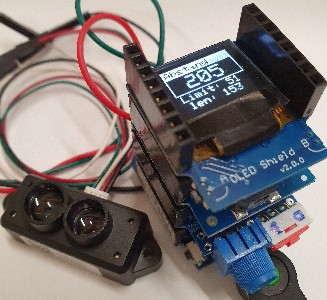
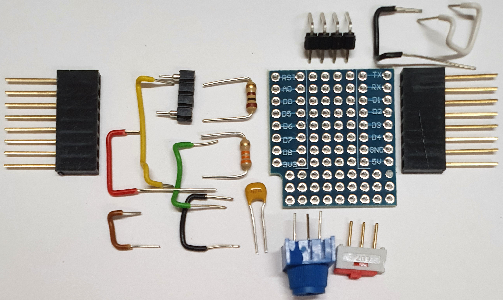
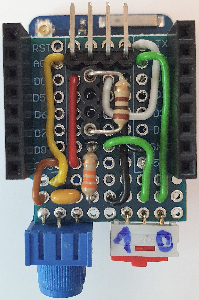

# Distance measurement with LIDAR TFmini and display on OLED 0.66"
Sketch: D1_oop98_tf02pro_oled66_1.ino, Version 2021-11-24   
[--> Deutsche Version](./LIESMICH.md "Deutsche Version")   

## Function
This program for the D1 mini or ESP32mini (ESP32-WROOM-32) does the following:   
1. Periodically read TFmini data via serial interface and calculate the distance (in cm).   
2. Display of the distance on a display (OLED 0,66").   
3. Output of a melody, if a minimum distance (limit) is fallen below.   
4. Setting of the limit value by means of a potentiometer. (Read in as analog value)   

## Hardware required
1. D1 mini or ESP32mini (ESP32-WROOM-32)   
2. Do-it-yourself TF adapter shield: potentiometer for input of analog value, pins for LIDAR connection (TFmini or TF02)   
3. Buzzer shield @ D5 (GPIO18)
4. OLED 0.66" shield @ I2C
5. LIDAR TFmini (0.1m to 12m) or TF02 (0.1m to 40m)

   
_Fig. 1: Distance measurement with LIDAR TFmini_   

## Selfmade TF-Adapter-Shield
The self-construction TF-Adapter-Shield contains   
* a potentiometer for the input of the analog value,   
* a voltage divider for the RXD line (in case you get a 5V signal from a LIDAR)   
* a switch to disconnect the RXD line from the RXD pin (important during programming ;) )
* pins for the LIDAR connection (5V RXD TXD GND)   

   
_Fig. 2: Circuit of the TF-Adaper-Shield_   

   
_Fig. 3: Components for the TF-Adaper-Shield_   
__*Component values*__   
`R1 ... ` Voltage divider. For URX_in = 5V: 47k&#x2126;, for 3.3V: 0&#x2126; (in figure 4: 100&#x2126;).   
`R2 ... ` Voltage divider 100k&#x2126; (in picture 4: 33k&#x2126;)   
`RP ... ` Potentiometer 5k&#x2126; or 50k&#x2126;   
`C1 ... ` Capacitor 100nF...470nF   

 &nbsp; 
   
_Fig. 4: Assembled TF-Adaper-Shield_   

## Program details
### Processor-specific properties
The processor dependent program parts are controlled by `#define` statements:   
Definition of the processor:   
```   
#define D1MINI 1 // ESP8266 D1mini +pro
```  
or for ESP32   
```   
#define ESP32D1 2 // ESP32 D1mini   
```   
and in the program code   
```   
 #if defined(ESP32) || defined(ESP32D1)
  // Code for the ESP32
 #else
  // code for the D1mini
 #endif
```   
If there is no processor definition, code for the D1mini is generated.   

### Evaluation of LIDAR data
The LIDAR continuously sends data blocks of 9 bytes with the following structure:   
`0x59 0x59 DistLo DistHi StrLo StrHi Byte6 0x00 Checksum`   

* The distance in cm is calculated as `256 * DistHi + DistLo`.   
* `StrXx` stands for Strength and indicates the signal strength.   
* `Byte6` means at the TF02 the "credibility" of the data block as value from 0 to 8, where 7..8 is good. With the TFmini, byte6 indicates the distance mode of the measurement (02 = short distance, 07 = long distance).   
* The checksum is the lower byte of the sum of the first 8 bytes.   

### Sound
When the distance limit is undershot, a melody sounds whose tones are generated with the help of the tone function (pitch = frequency) and a timer interrupt (tone length).   
The following lines are required in the program for this:   
```   
#define PIN_BUZZER D5 // D5 -> 18
//.......buzzer object and interrupt service routine............
buzzer1 buzzer(PIN_BUZZER); // buzzer object
#if defined(ESP32) || defined(ESP32D1)
 IRAM_ATTR void buzzer1_onTime() { buzzer.timer_ISR(NULL); }
#else
 ICACHE_RAM_ATTR void buzzer1_ISR(void *pArg) { buzzer.timer_ISR(NULL); }
#endif

String melody1="$T120L8MSO5 GC GC";
```   
Set the interrupt routine and the melody:   
```   
void setup()
{
 //------setup buzzer-------------------------------------------
 #if defined(ESP32) || defined(ESP32D1)
  buzzer.setISR32(buzzer1_onTime);
 #else
  buzzer.setISR(buzzer1_ISR); // set name of ISR
 #endif
 buzzer.setMelody(melody1); // set new melody

 //...
}
```   
Start the melody when the minimum distance is not reached:   
```   
          if(dist<distMin) buzzer.start();
```   

__*Creating the melody*__   
The melody is represented by a string containing the notes to be played:   
* `CDEFGABn ... ` notes   
* _`n` = note length_:   
`1, 2, 4, 8, 16, 32, 64` (normal: whole, half, quarter, ... -note).   
`2, 4, 8, 16, 32` (dotted or 3, 6, 12, 24, 48)   
4, 8, 16, 32 (triplet or 34, 38, 316, 332)   
If _`n`_ is omitted, the default value of `Ln` is used.   
* `Rn ... ` pause with length `n` (= note length).   
If _`n`_ is omitted, the default value of `Ln` is used.   
* `Tn ...` Tempo `n` = 32 to 255 BPM   
(default value is 120 BPM, 4/4 time base).   
* `On ...` Octave `n` = 1-8 (default is 4)   
* `Ln ... ` default note length (default is n = 4, i.e. quarter note).   
* `Mx ... ` Music style   
   * `MN ` Music normal: 7/8 note length (default)   
   * `ML ` Music legato: full note length   
   * `MS ` Music staccato: 3/4 note length duration   
   * `MU ` Mute mode   
   ---   
* `< ... ` one octave down (range 1-8)   
* `> ... ` one octave up (range 1-8)   
* `[ ... ` transpose one step down (range -12 to 12)   
* `] ... ` transpose one step up (range -12 to 12)   
* `# ... ` transposition sign "cross" (stands after the note, e.g. D#n)   
* `- ... ` Disposition sign "b" (stands after the note, e.g. D-n)   
* `. ... ` Dotted note (note length is increased by 50%)   
* `$ ... ` Resets the default settings. Should be at the beginning of a new song.   
_Examples_:   
`String melodyBigBen="$T120 L4 O5 ECD<GR2 G>DEC R2";`   
`String melodyEurope="$T240 MN EEFG GFED CCDE ML E. MN D8D2 R1R1";`   
`String melodyJingleBells="$T240 EEE2 EEE2 EGC.D8 E1 FFF.F8 FEEE8E8 EDDE D2G2 EEE2 EEE2 EGC.D8 E1 FFF.F8 FEEE8E8 GGFD C1 R1";`   
